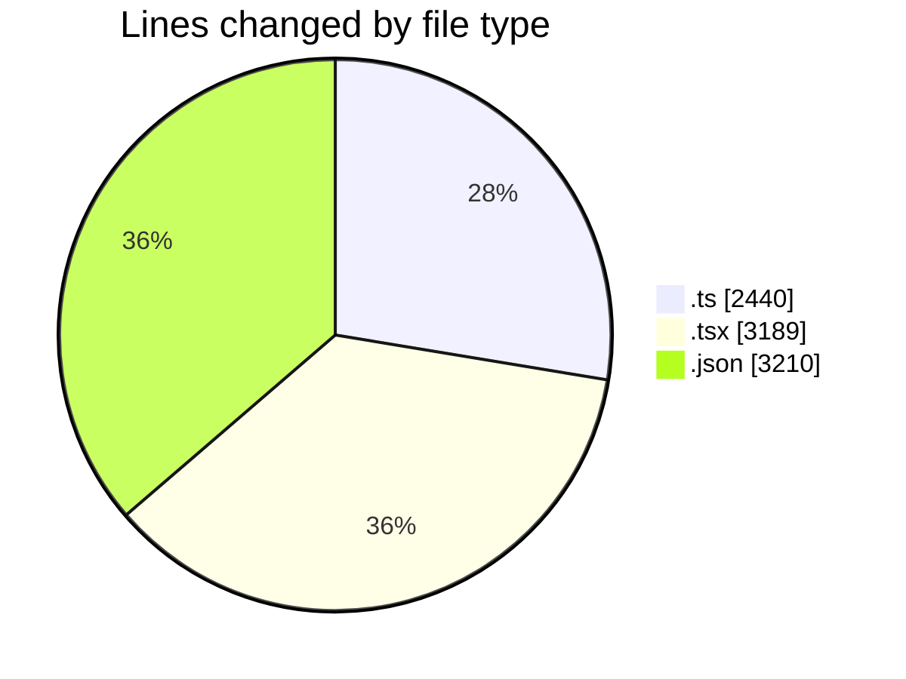
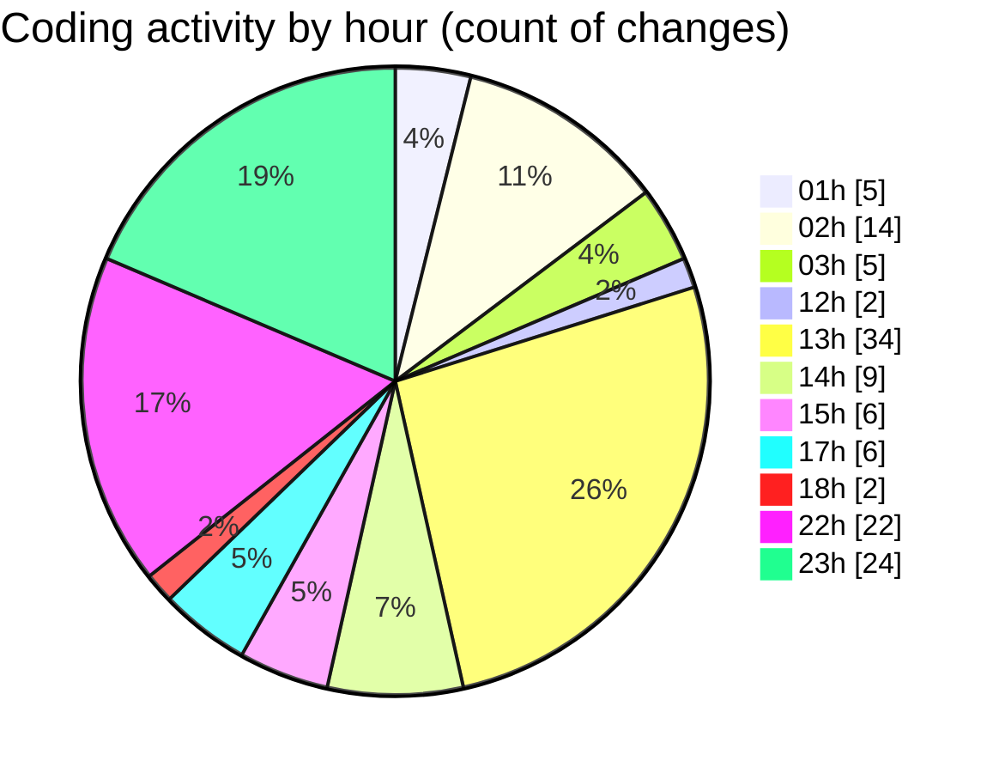

# eventscop-frontend-guide (Workspace) - Activity Summary 

## Overall Statistics

| Stat                   | Value                                                             |
| ---------------------- | ----------------------------------------------------------------- |
| **Lines Added** (➕)   | 8442                                          |
| **Lines Removed** (➖) | 397                                        |
| **Net Change** (↕)    | 8045                |
| **Active Time** (⌚)   | 144 minutes |

## Modified Files
- **pages.ts** (+684, -102)
- **page.tsx** (+257, -1)
- **suppliers.ts** (+530, -15)
- **CityInputWithRadius.tsx** (+195, -0)
- **dynamic.ts** (+348, -0)
- **page.tsx** (+599, -1)
- **types.ts** (+170, -0)
- **FooterSection.tsx** (+34, -0)
- **FooterContact.tsx** (+33, -0)
- **page.tsx** (+190, -0)
- **page.tsx** (+552, -83)
- **page.tsx** (+307, -1)
- **fr.json** (+2915, -0)
- **settings.json** (+295, -0)
- **routing.ts** (+209, -6)
- **page.ts** (+85, -0)
- **page.tsx** (+305, -31)
- **page.tsx** (+293, -152)
- **seo.ts** (+128, -0)
- **EditorialTextBlock.tsx** (+34, -1)
- **GeneralEntityTextBlock.tsx** (+50, -2)
- **Button.tsx** (+66, -2)
- **city.ts** (+163, -0)

## Visualizations

### By File Type (Lines Changed)

### By Hour (Estimated Activity Count)

> **Last Updated:** 10/23/2025, 11:48:15 PM