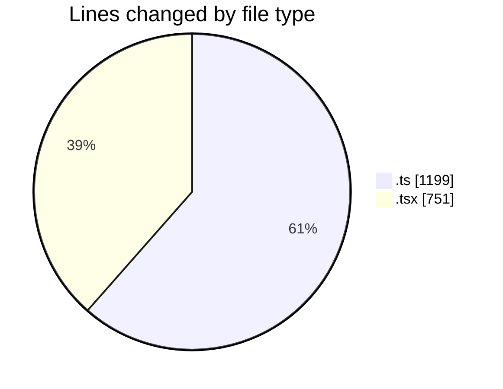
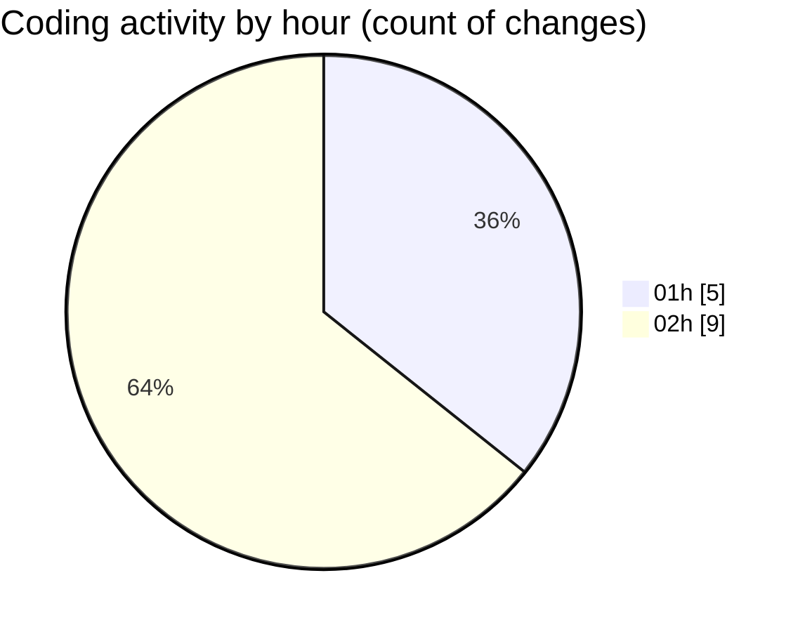

# eventscop-frontend-guide (Workspace) - Activity Summary 

## Overall Statistics

| Stat                   | Value                                                             |
| ---------------------- | ----------------------------------------------------------------- |
| **Lines Added** (➕)   | 1926                                          |
| **Lines Removed** (➖) | 24                                        |
| **Net Change** (↕)    | 1902                |
| **Active Time** (⌚)   | 19 minutes |

## Modified Files
- **pages.ts** (+301, -8)
- **page.tsx** (+257, -1)
- **suppliers.ts** (+530, -15)
- **CityInputWithRadius.tsx** (+195, -0)
- **dynamic.ts** (+345, -0)
- **page.tsx** (+298, -0)

## Visualizations

### By File Type (Lines Changed)

### By Hour (Estimated Activity Count)

> **Last Updated:** 10/23/2025, 2:30:45 AM