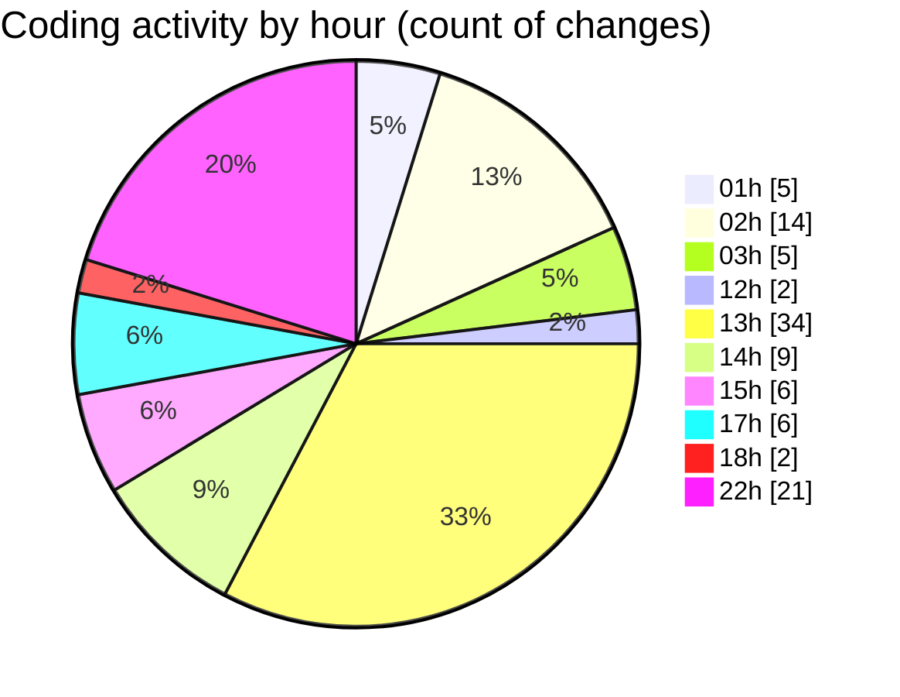

# eventscop-frontend-guide (Workspace) - Activity Summary 

## Overall Statistics

| Stat                   | Value                                                             |
| ---------------------- | ----------------------------------------------------------------- |
| **Lines Added** (➕)   | 7798                                          |
| **Lines Removed** (➖) | 286                                        |
| **Net Change** (↕)    | 7512                |
| **Active Time** (⌚)   | 126 minutes |

## Modified Files
- **pages.ts** (+684, -8)
- **page.tsx** (+257, -1)
- **suppliers.ts** (+530, -15)
- **CityInputWithRadius.tsx** (+195, -0)
- **dynamic.ts** (+348, -0)
- **page.tsx** (+303, -1)
- **types.ts** (+170, -0)
- **FooterSection.tsx** (+34, -0)
- **FooterContact.tsx** (+33, -0)
- **page.tsx** (+95, -0)
- **page.tsx** (+552, -83)
- **page.tsx** (+307, -1)
- **fr.json** (+2907, -0)
- **settings.json** (+295, -0)
- **routing.ts** (+209, -0)
- **page.ts** (+85, -0)
- **page.tsx** (+297, -26)
- **page.tsx** (+285, -151)
- **seo.ts** (+128, -0)
- **EditorialTextBlock.tsx** (+34, -0)
- **GeneralEntityTextBlock.tsx** (+50, -0)

## Visualizations

### By File Type (Lines Changed)

### By Hour (Estimated Activity Count)

> **Last Updated:** 10/23/2025, 10:53:15 PM