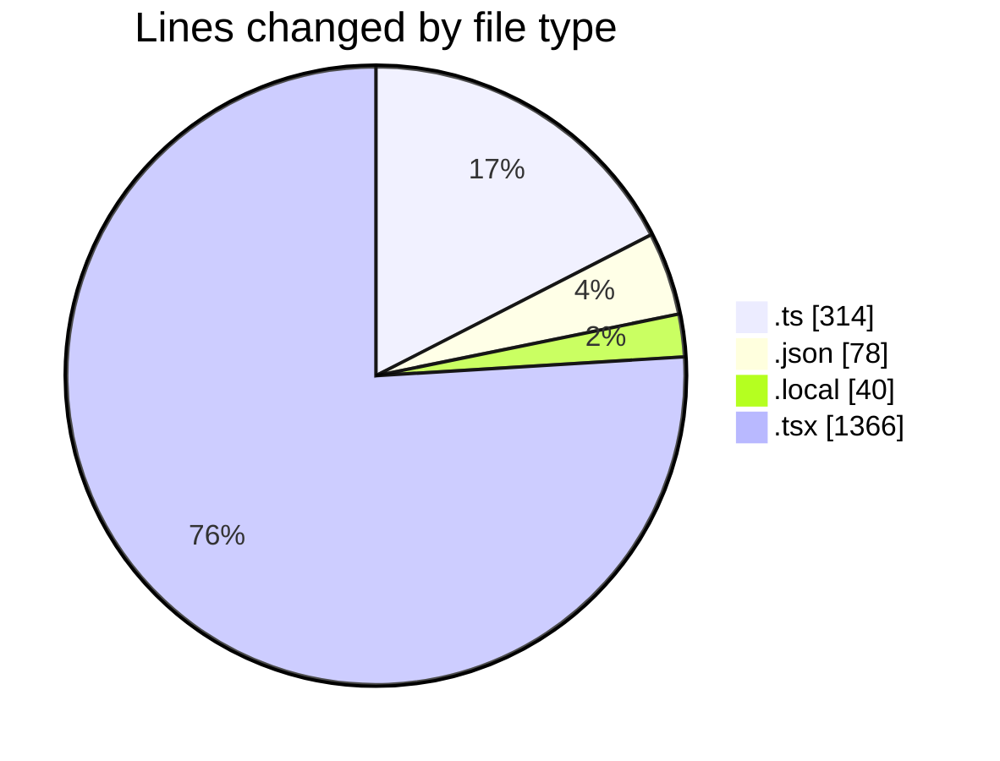
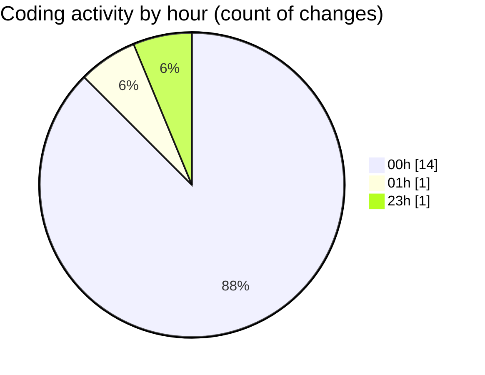

# frontend-cms - Activity Summary 

## Overall Statistics

| Stat                   | Value                                                             |
| ---------------------- | ----------------------------------------------------------------- |
| **Lines Added** (➕)   | 1793                                          |
| **Lines Removed** (➖) | 5                                        |
| **Net Change** (↕)    | 1788                |
| **Active Time** (⌚)   | 29 minutes |

## Modified Files
- **next.config.ts** (+38, -0)
- **settings.json** (+3, -0)
- **tasks.json** (+74, -1)
- **client.ts** (+83, -0)
- **.env.local** (+36, -4)
- **page.tsx** (+952, -0)
- **auth.ts** (+193, -0)
- **page.tsx** (+414, -0)

## Visualizations

### By File Type (Lines Changed)

### By Hour (Estimated Activity Count)

> **Last Updated:** 10/23/2025, 1:36:09 AM