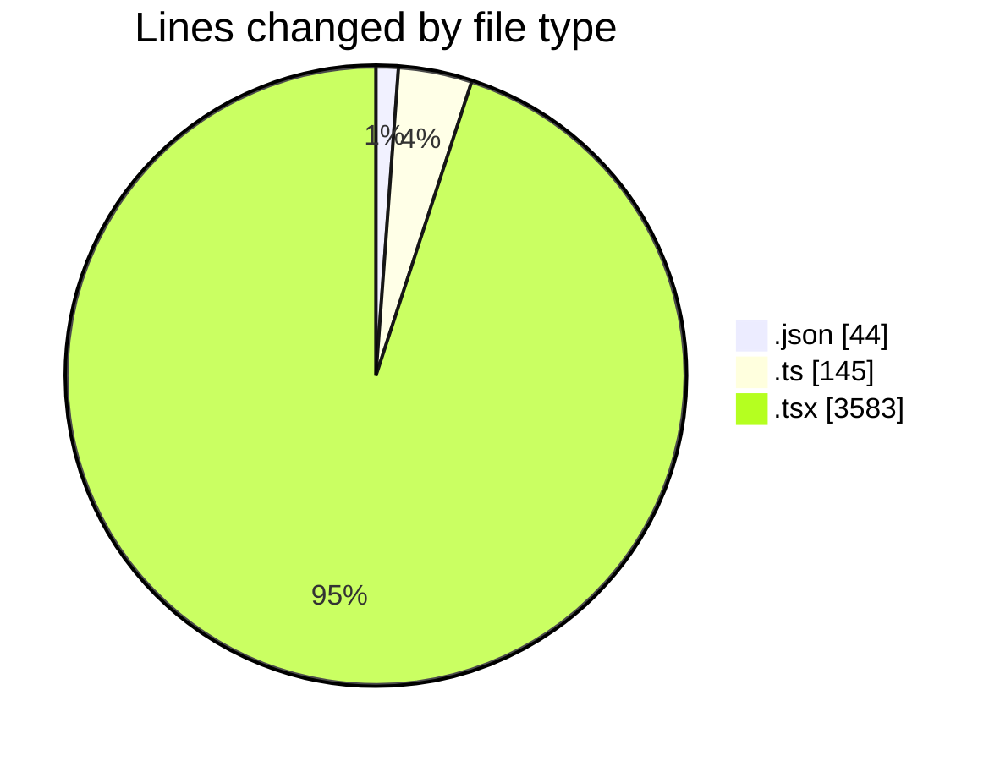
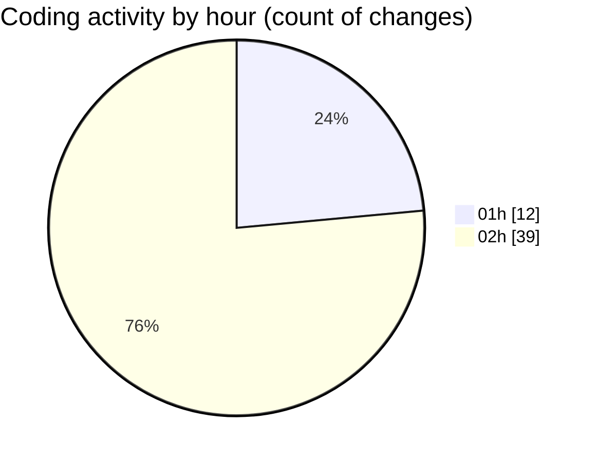

# eventscop-frontend-guide (Workspace) - Activity Summary 

## Overall Statistics

| Stat                   | Value                                                             |
| ---------------------- | ----------------------------------------------------------------- |
| **Lines Added** (➕)   | 3733                                          |
| **Lines Removed** (➖) | 39                                        |
| **Net Change** (↕)    | 3694                |
| **Active Time** (⌚)   | 68 minutes |

## Modified Files
- **settings.json** (+44, -0)
- **pages.ts** (+98, -0)
- **page.tsx** (+174, -4)
- **page.tsx** (+40, -3)
- **page.ts** (+47, -0)
- **page.tsx** (+42, -7)
- **page.tsx** (+555, -3)
- **page.tsx** (+849, -0)
- **page.tsx** (+116, -0)
- **page.tsx** (+243, -0)
- **page.tsx** (+331, -0)
- **page.tsx** (+382, -21)
- **page.tsx** (+411, -1)
- **page.tsx** (+78, -0)
- **page.tsx** (+122, -0)
- **page.tsx** (+114, -0)
- **page.tsx** (+87, -0)

## Visualizations

### By File Type (Lines Changed)

### By Hour (Estimated Activity Count)

> **Last Updated:** 10/24/2025, 2:33:15 AM