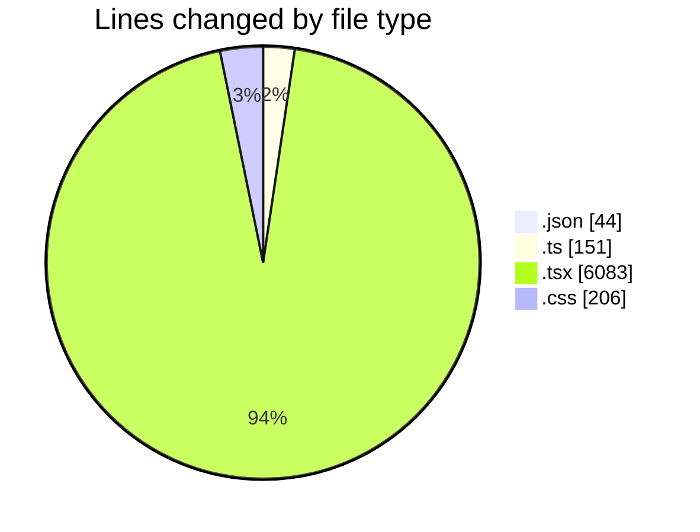
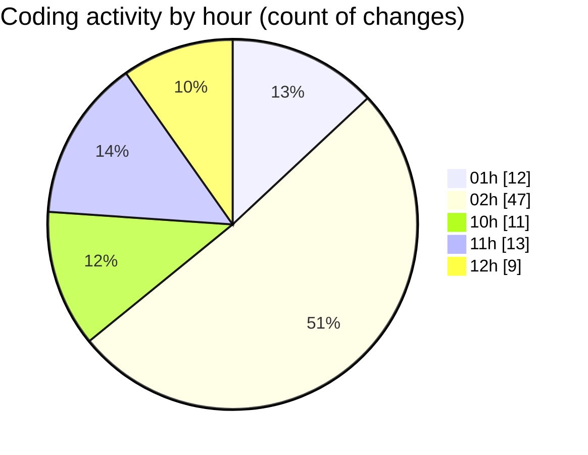

# eventscop-frontend-guide (Workspace) - Activity Summary 

## Overall Statistics

| Stat                   | Value                                                             |
| ---------------------- | ----------------------------------------------------------------- |
| **Lines Added** (➕)   | 5031                                          |
| **Lines Removed** (➖) | 1453                                        |
| **Net Change** (↕)    | 3578                |
| **Active Time** (⌚)   | 112 minutes |

## Modified Files
- **settings.json** (+44, -0)
- **pages.ts** (+98, -0)
- **page.tsx** (+174, -15)
- **page.tsx** (+40, -3)
- **page.ts** (+47, -6)
- **page.tsx** (+42, -7)
- **page.tsx** (+1110, -1016)
- **page.tsx** (+849, -1)
- **page.tsx** (+116, -1)
- **page.tsx** (+243, -8)
- **page.tsx** (+331, -309)
- **page.tsx** (+400, -21)
- **page.tsx** (+411, -8)
- **page.tsx** (+78, -8)
- **page.tsx** (+122, -7)
- **page.tsx** (+114, -7)
- **page.tsx** (+87, -8)
- **PlaceFilterContent.tsx** (+302, -10)
- **SecurityIndicatorsSection.tsx** (+47, -2)
- **MethodologySection.tsx** (+84, -14)
- **HeroSection.tsx** (+36, -1)
- **globals.css** (+205, -1)
- **Discover.tsx** (+51, -0)

## Visualizations

### By File Type (Lines Changed)

### By Hour (Estimated Activity Count)

> **Last Updated:** 10/24/2025, 12:29:52 PM