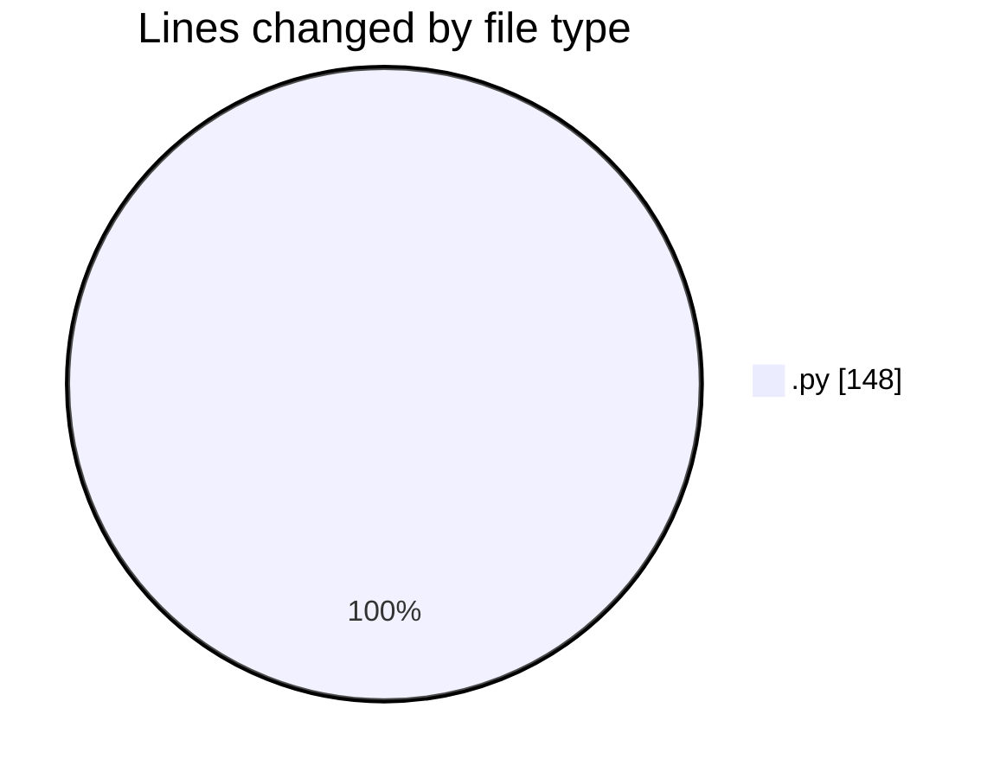
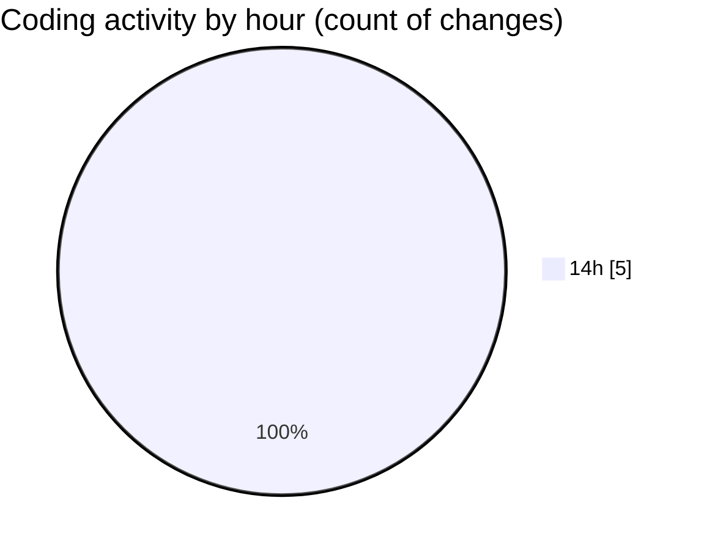

# eventscop-api-guide (Workspace) - Activity Summary 

## Overall Statistics

| Stat                   | Value                                                             |
| ---------------------- | ----------------------------------------------------------------- |
| **Lines Added** (➕)   | 148                                          |
| **Lines Removed** (➖) | 0                                        |
| **Net Change** (↕)    | 148                |
| **Active Time** (⌚)   | 9 minutes |

## Modified Files
- **SupplierActivity.py** (+62, -0)
- **bd72f241f302_change_activity_type_location_to_2fields.py** (+86, -0)

## Visualizations

### By File Type (Lines Changed)

### By Hour (Estimated Activity Count)

> **Last Updated:** 10/27/2025, 2:22:16 PM