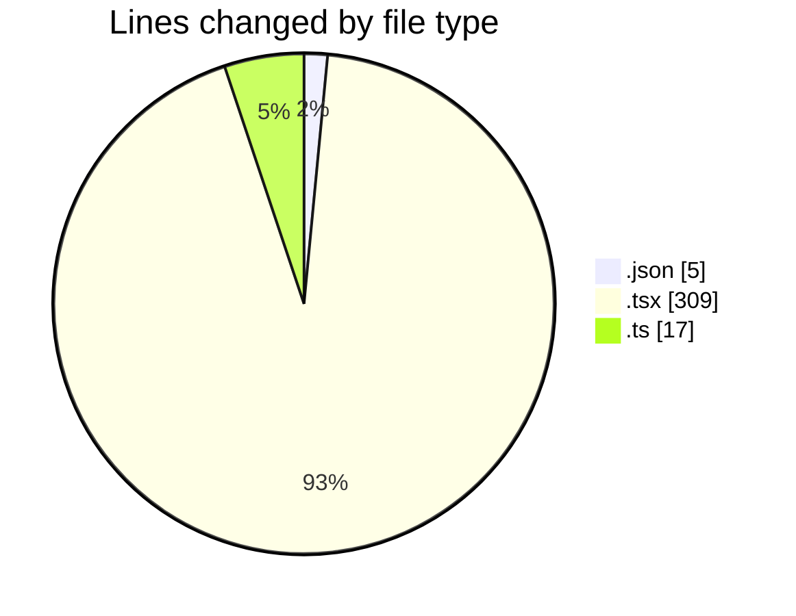
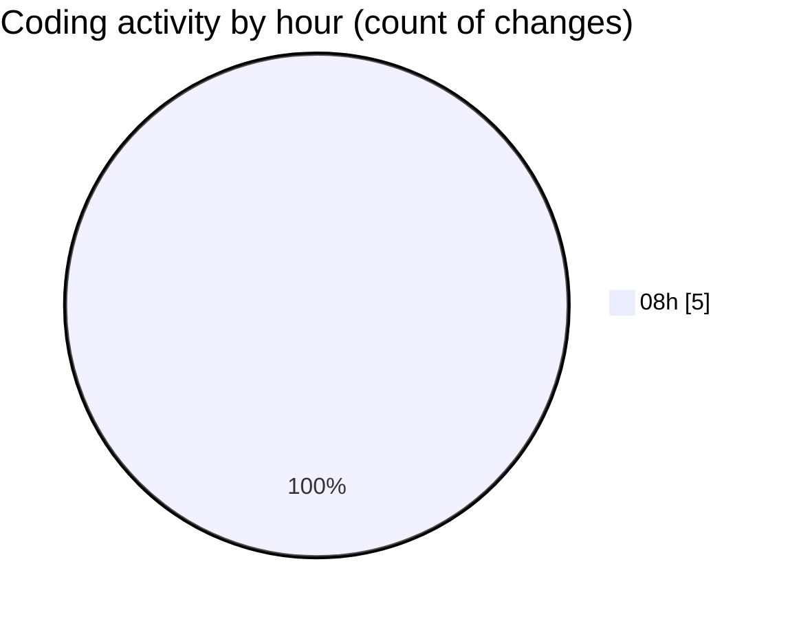

# eventscop-frontend-guide (Workspace) - Activity Summary 

## Overall Statistics

| Stat                   | Value                                                             |
| ---------------------- | ----------------------------------------------------------------- |
| **Lines Added** (➕)   | 329                                          |
| **Lines Removed** (➖) | 2                                        |
| **Net Change** (↕)    | 327                |
| **Active Time** (⌚)   | 7 minutes |

## Modified Files
- **package.json** (+3, -2)
- **page.tsx** (+309, -0)
- **auth-token-manager.ts** (+17, -0)

## Visualizations

### By File Type (Lines Changed)

### By Hour (Estimated Activity Count)

> **Last Updated:** 10/27/2025, 8:52:13 AM