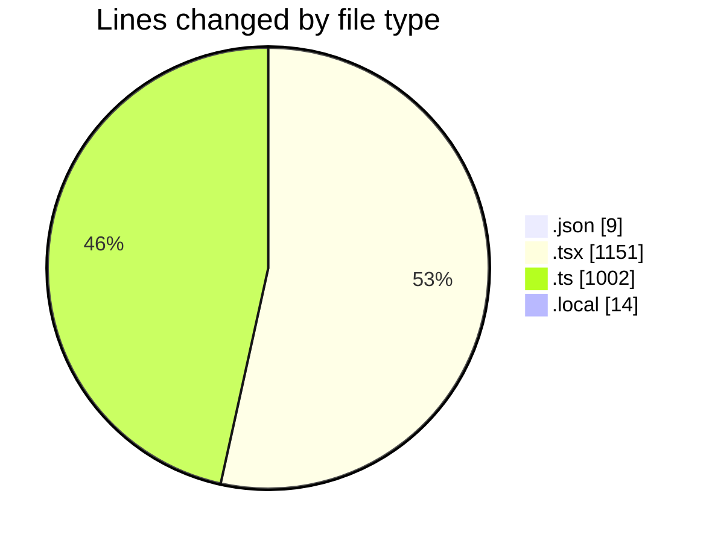
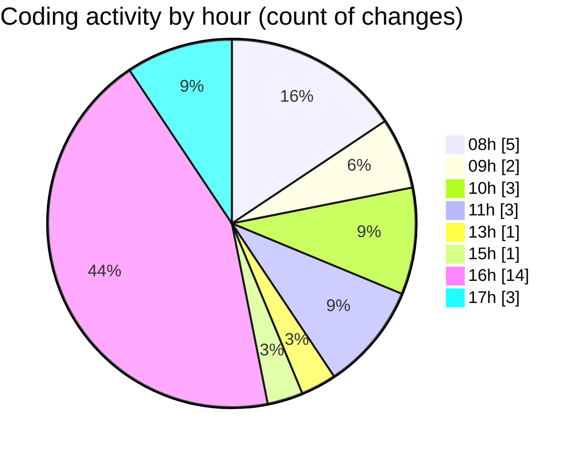

# eventscop-frontend-guide (Workspace) - Activity Summary 

## Overall Statistics

| Stat                   | Value                                                             |
| ---------------------- | ----------------------------------------------------------------- |
| **Lines Added** (➕)   | 1731                                          |
| **Lines Removed** (➖) | 445                                        |
| **Net Change** (↕)    | 1286                |
| **Active Time** (⌚)   | 27 minutes |

## Modified Files
- **package.json** (+5, -4)
- **page.tsx** (+332, -29)
- **auth-token-manager.ts** (+17, -0)
- **seo.ts** (+130, -0)
- **city.ts** (+188, -0)
- **search-tags.ts** (+407, -259)
- **page.tsx** (+637, -153)
- **crypto-decrypt.ts** (+1, -0)
- **.env.local** (+14, -0)

## Visualizations

### By File Type (Lines Changed)

### By Hour (Estimated Activity Count)

> **Last Updated:** 10/27/2025, 5:27:14 PM