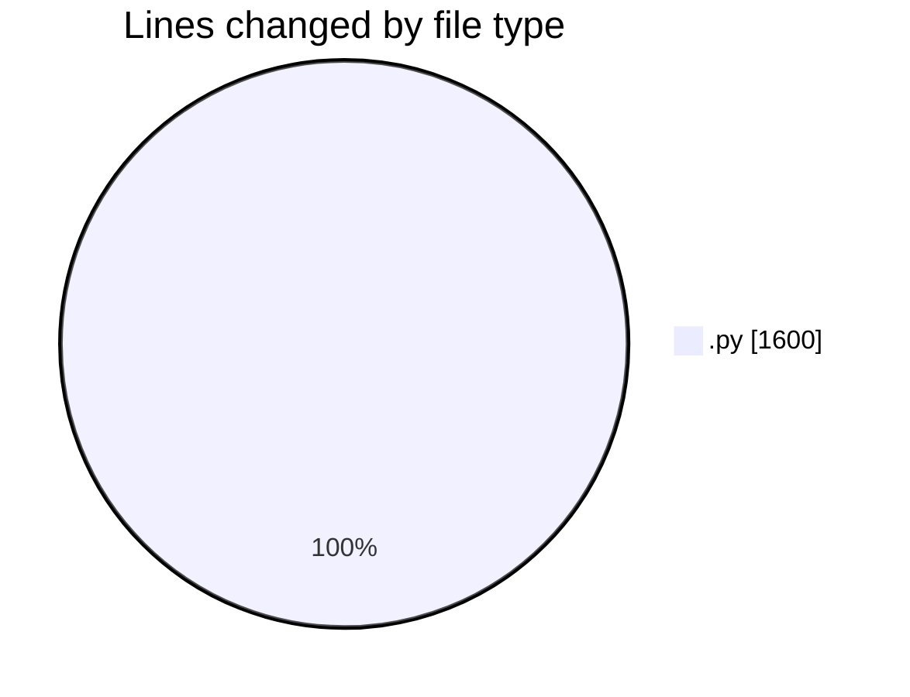
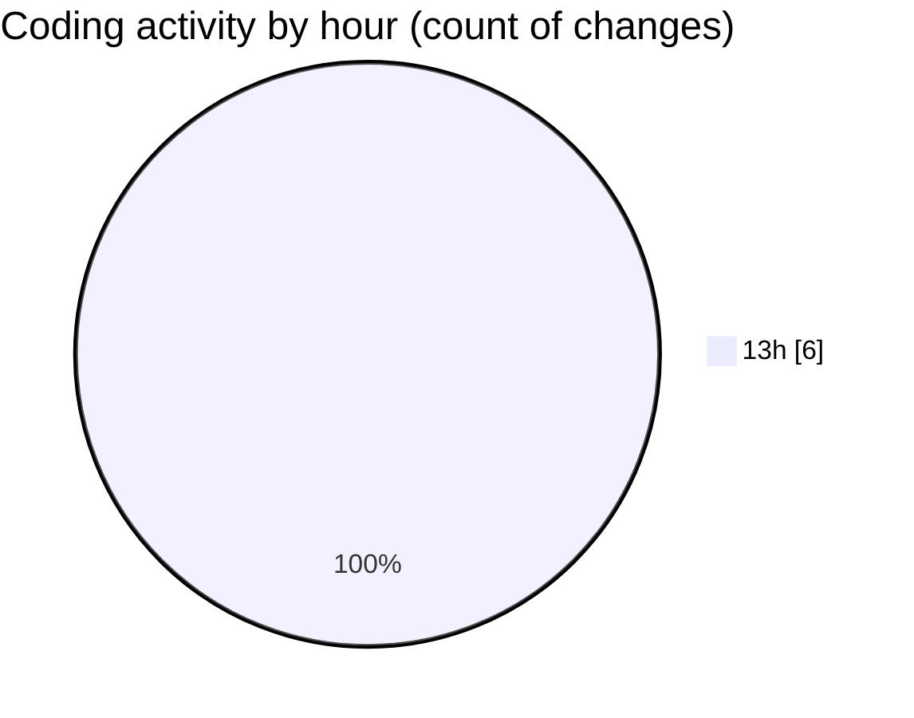

# eventscop-api-guide (Workspace) - Activity Summary 

## Overall Statistics

| Stat                   | Value                                                             |
| ---------------------- | ----------------------------------------------------------------- |
| **Lines Added** (➕)   | 1595                                          |
| **Lines Removed** (➖) | 5                                        |
| **Net Change** (↕)    | 1590                |
| **Active Time** (⌚)   | 3 minutes |

## Modified Files
- **search_engine.py** (+1070, -5)
- **routes.py** (+264, -0)
- **routes.py** (+261, -0)

## Visualizations

### By File Type (Lines Changed)

### By Hour (Estimated Activity Count)

> **Last Updated:** 10/28/2025, 2:02:20 PM