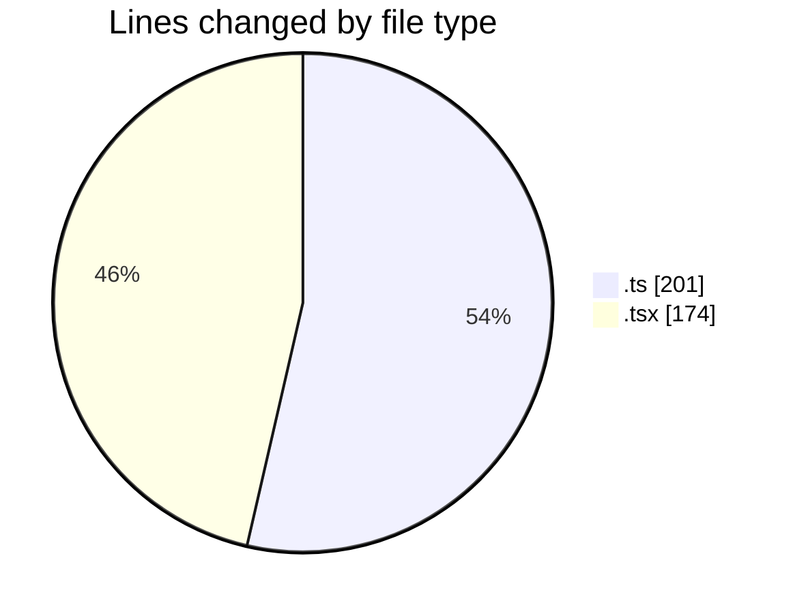
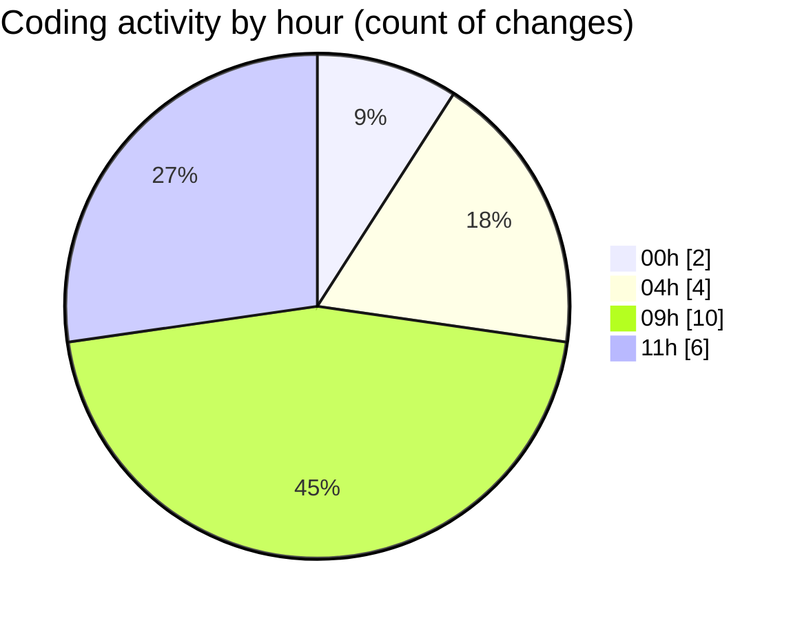

# eventscop-frontend-guide (Workspace) - Activity Summary 

## Overall Statistics

| Stat                   | Value                                                             |
| ---------------------- | ----------------------------------------------------------------- |
| **Lines Added** (➕)   | 337                                          |
| **Lines Removed** (➖) | 38                                        |
| **Net Change** (↕)    | 299                |
| **Active Time** (⌚)   | 29 minutes |

## Modified Files
- **crypto-final.ts** (+4, -0)
- **layout.tsx** (+1, -1)
- **crypto-vigenere.ts** (+90, -15)
- **route.ts** (+32, -5)
- **auth.ts** (+3, -1)
- **AuthenticationButtons.tsx** (+4, -16)
- **page.tsx** (+152, -0)
- **track-visit.ts** (+51, -0)

## Visualizations

### By File Type (Lines Changed)

### By Hour (Estimated Activity Count)

> **Last Updated:** 10/28/2025, 11:47:17 AM