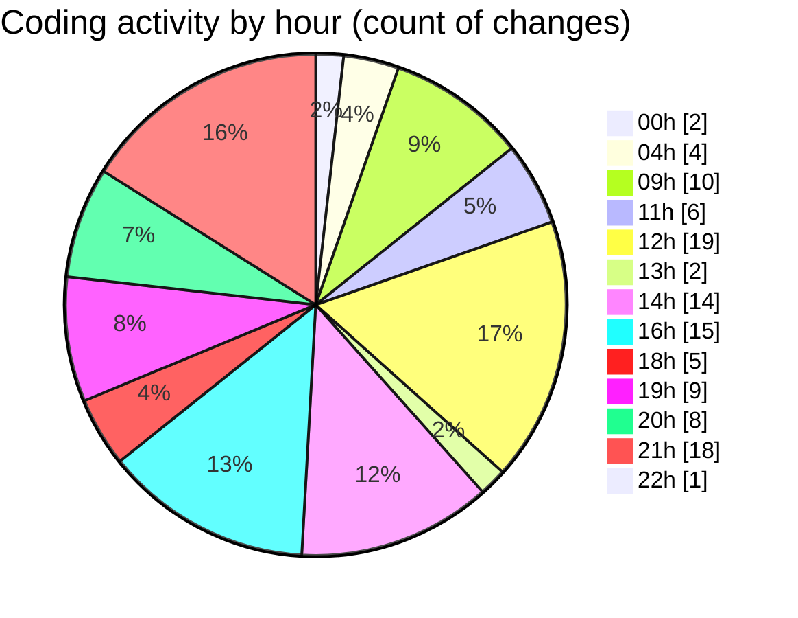

# eventscop-frontend-guide (Workspace) - Activity Summary 

## Overall Statistics

| Stat                   | Value                                                             |
| ---------------------- | ----------------------------------------------------------------- |
| **Lines Added** (➕)   | 9348                                          |
| **Lines Removed** (➖) | 564                                        |
| **Net Change** (↕)    | 8784                |
| **Active Time** (⌚)   | 157 minutes |

## Modified Files
- **crypto-final.ts** (+4, -0)
- **layout.tsx** (+1, -2)
- **crypto-vigenere.ts** (+92, -15)
- **route.ts** (+32, -5)
- **auth.ts** (+135, -18)
- **AuthenticationButtons.tsx** (+4, -16)
- **page.tsx** (+152, -0)
- **track-visit.ts** (+52, -0)
- **page.tsx** (+510, -0)
- **page.tsx** (+611, -0)
- **.env.local** (+1, -1)
- **route.ts** (+84, -0)
- **MapColumnContainer.tsx** (+29, -0)
- **Header.tsx** (+0, -3)
- **suppliers.ts** (+303, -67)
- **ReviewsModal.tsx** (+139, -14)
- **useBriefSubmission.ts** (+63, -0)
- **AddReviewModal.tsx** (+288, -0)
- **StepContact.tsx** (+296, -0)
- **page.tsx** (+313, -0)
- **fr.json** (+3476, -0)
- **layout.tsx** (+192, -149)
- **layout.tsx** (+168, -113)
- **print-suppliers.ts** (+133, -0)
- **layout.tsx** (+40, -0)
- **page.tsx** (+185, -4)
- **VenuePricing.tsx** (+41, -0)
- **page.tsx** (+309, -147)
- **page.tsx** (+309, -5)
- **page.tsx** (+295, -3)
- **useSearchSync.ts** (+312, -2)
- **utils-client.ts** (+272, -0)
- **globals.css** (+221, -0)
- **SearchResults.tsx** (+50, -0)
- **PlaceList.tsx** (+154, -0)
- **place-list.ts** (+36, -0)
- **constants.ts** (+46, -0)

## Visualizations

### By File Type (Lines Changed)

### By Hour (Estimated Activity Count)

> **Last Updated:** 10/28/2025, 10:12:29 PM