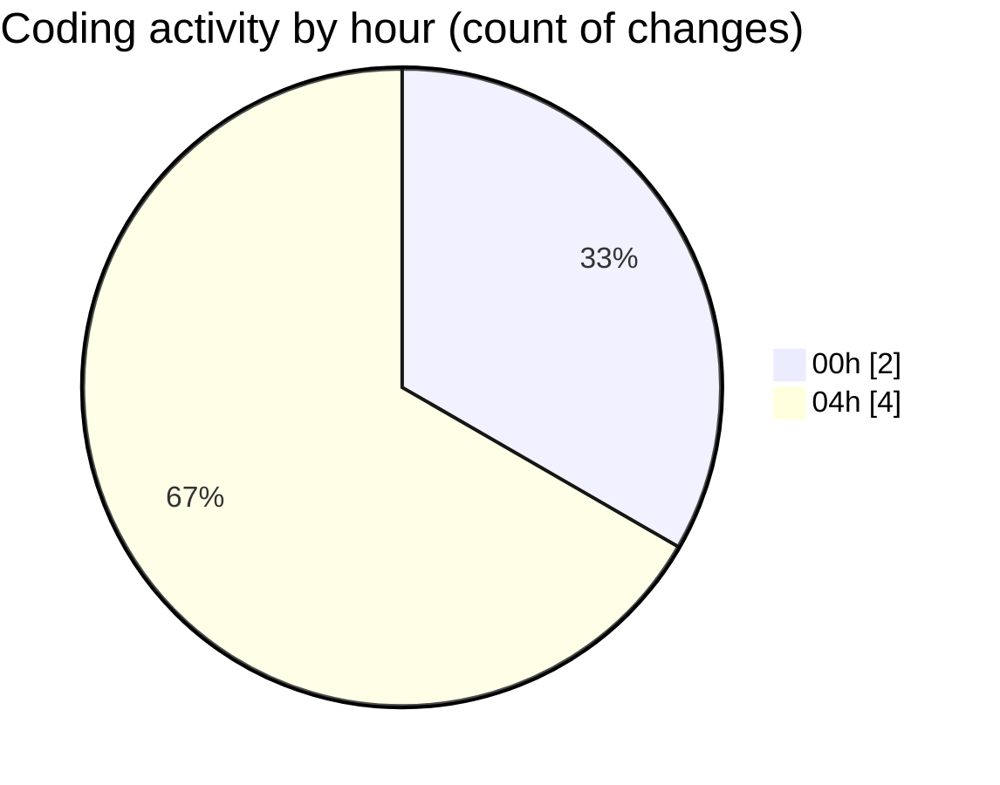

# eventscop-frontend-guide (Workspace) - Activity Summary 

## Overall Statistics

| Stat                   | Value                                                             |
| ---------------------- | ----------------------------------------------------------------- |
| **Lines Added** (➕)   | 94                                          |
| **Lines Removed** (➖) | 8                                        |
| **Net Change** (↕)    | 86                |
| **Active Time** (⌚)   | 6 minutes |

## Modified Files
- **crypto-final.ts** (+4, -0)
- **layout.tsx** (+1, -0)
- **crypto-vigenere.ts** (+89, -8)

## Visualizations

### By File Type (Lines Changed)

### By Hour (Estimated Activity Count)

> **Last Updated:** 10/28/2025, 4:42:17 AM