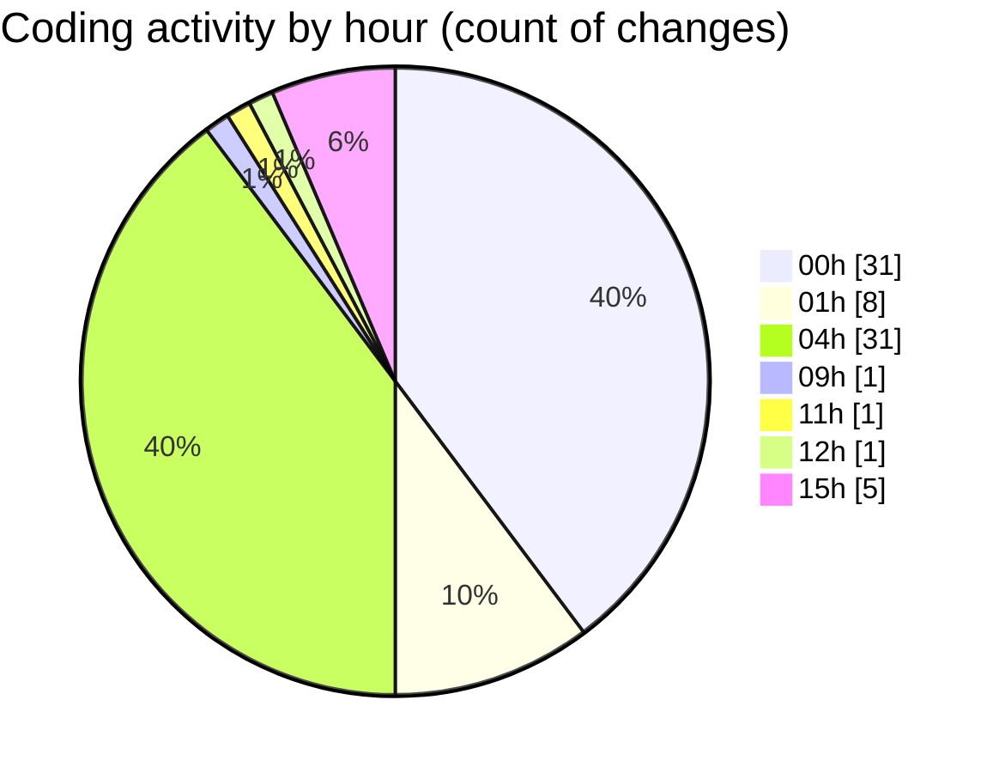

# usr.aleoudev.fr (Workspace) - Activity Summary 

## Overall Statistics

| Stat                   | Value                                                             |
| ---------------------- | ----------------------------------------------------------------- |
| **Lines Added** (➕)   | 1789                                          |
| **Lines Removed** (➖) | 393                                        |
| **Net Change** (↕)    | 1396                |
| **Active Time** (⌚)   | 119 minutes |

## Modified Files
- **session.asp** (+104, -93)
- **crypto-vigenere.asp** (+534, -289)
- **test-vigenere-final.asp** (+44, -4)
- **outils.asp** (+4, -0)
- **parametre.asp** (+78, -5)
- **crypto-final.asp** (+109, -0)
- **.gitignore** (+14, -0)
- **send_email.asp** (+900, -0)
- **work.asp** (+2, -2)

## Visualizations

### By File Type (Lines Changed)

### By Hour (Estimated Activity Count)

> **Last Updated:** 10/28/2025, 3:42:57 PM