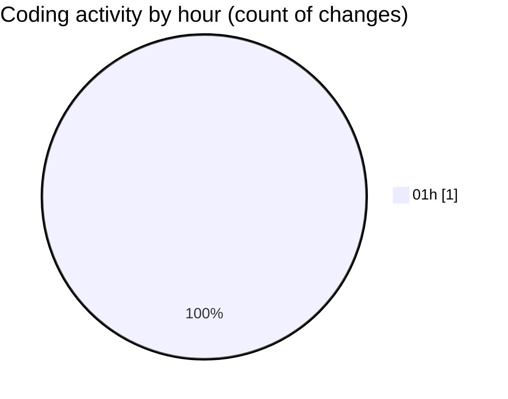

# eventscop-api-guide (Workspace) - Activity Summary 

## Overall Statistics

| Stat                   | Value                                                             |
| ---------------------- | ----------------------------------------------------------------- |
| **Lines Added** (➕)   | 1065                                          |
| **Lines Removed** (➖) | 0                                        |
| **Net Change** (↕)    | 1065                |
| **Active Time** (⌚)   | 0 minute |

## Modified Files
- **search_engine.py** (+1065, -0)

## Visualizations

### By File Type (Lines Changed)

### By Hour (Estimated Activity Count)

> **Last Updated:** 10/29/2025, 1:10:41 AM