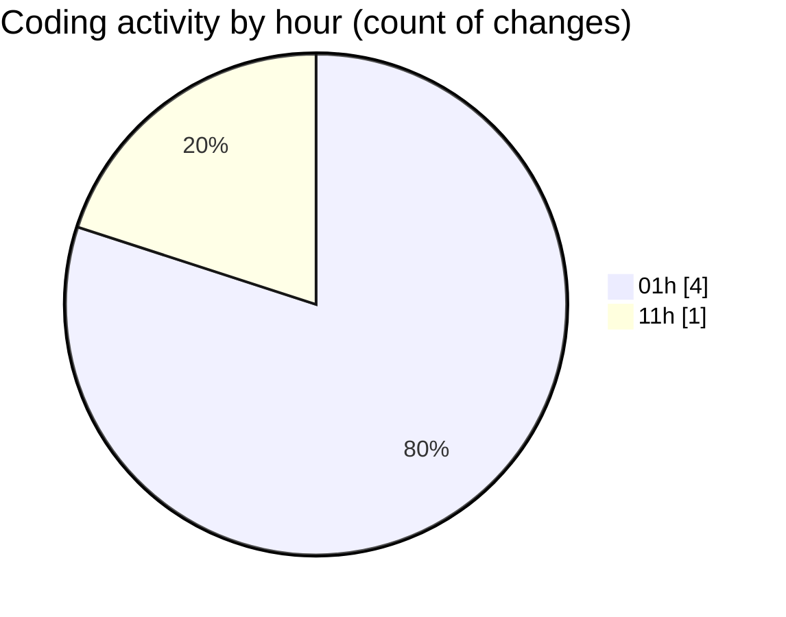

# eventscop-api-guide (Workspace) - Activity Summary 

## Overall Statistics

| Stat                   | Value                                                             |
| ---------------------- | ----------------------------------------------------------------- |
| **Lines Added** (➕)   | 1097                                          |
| **Lines Removed** (➖) | 1                                        |
| **Net Change** (↕)    | 1096                |
| **Active Time** (⌚)   | 6 minutes |

## Modified Files
- **search_engine.py** (+1067, -1)
- **SupplierCategory.py** (+30, -0)

## Visualizations

### By File Type (Lines Changed)

### By Hour (Estimated Activity Count)

> **Last Updated:** 10/29/2025, 11:35:45 AM