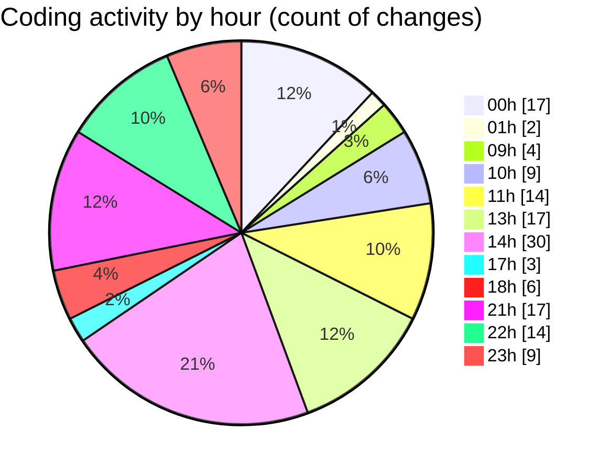

# eventscop-frontend-guide (Workspace) - Activity Summary 

## Overall Statistics

| Stat                   | Value                                                             |
| ---------------------- | ----------------------------------------------------------------- |
| **Lines Added** (➕)   | 6406                                          |
| **Lines Removed** (➖) | 357                                        |
| **Net Change** (↕)    | 6049                |
| **Active Time** (⌚)   | 201 minutes |

## Modified Files
- **fr.json** (+7, -0)
- **AuthenticationButtons.tsx** (+65, -0)
- **auth.ts** (+13, -0)
- **route.ts** (+81, -0)
- **Header.tsx** (+4, -4)
- **layout.tsx** (+8, -2)
- **HeaderCartButton.tsx** (+26, -0)
- **HeaderTopBar.tsx** (+5, -1)
- **crypto-vigenere.ts** (+0, -1)
- **.gitignore** (+79, -3)
- **biome.json** (+45, -1)
- **SupplierSearchClient.tsx** (+296, -110)
- **ActivitySearchClient.tsx** (+237, -82)
- **supplier-activities.ts** (+357, -2)
- **actions.ts** (+95, -12)
- **page.tsx** (+234, -39)
- **BudgetField.tsx** (+38, -0)
- **NumberInputField.tsx** (+49, -0)
- **field-components.ts** (+56, -0)
- **ar.json** (+272, -0)
- **cn.json** (+272, -0)
- **de.json** (+272, -0)
- **en.json** (+585, -0)
- **es.json** (+272, -0)
- **it.json** (+272, -0)
- **ru.json** (+272, -0)
- **Brief.tsx** (+334, -54)
- **settings.json** (+295, -0)
- **package.json** (+3, -2)
- **ResultsPagination.tsx** (+130, -0)
- **Footer.tsx** (+91, -0)
- **page.tsx** (+317, -0)
- **page.tsx** (+304, -0)
- **page.tsx** (+328, -26)
- **types.ts** (+177, -4)
- **page.tsx** (+343, -0)
- **BriefSummary.tsx** (+172, -14)

## Visualizations

### By File Type (Lines Changed)

### By Hour (Estimated Activity Count)

> **Last Updated:** 10/29/2025, 11:09:42 PM