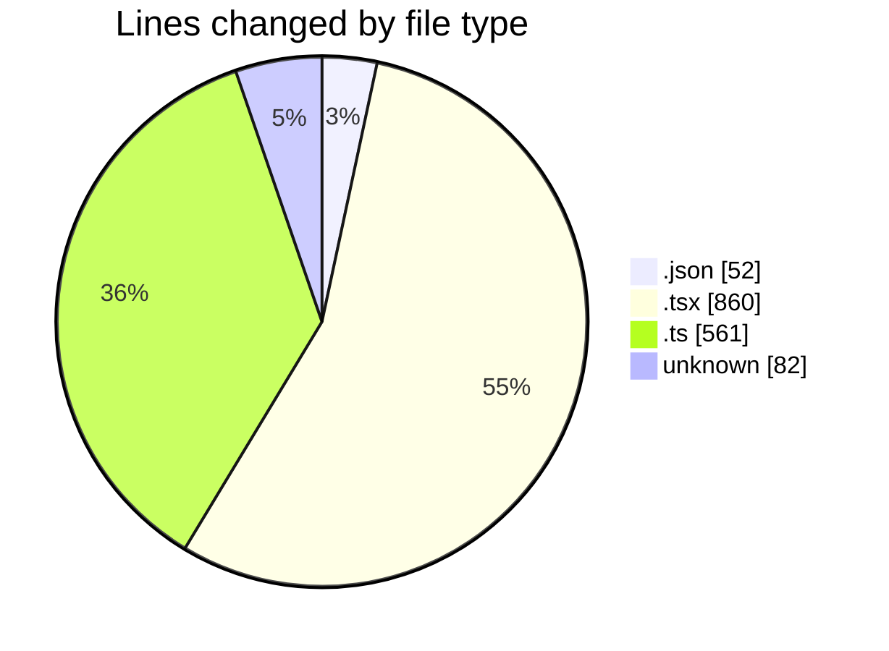
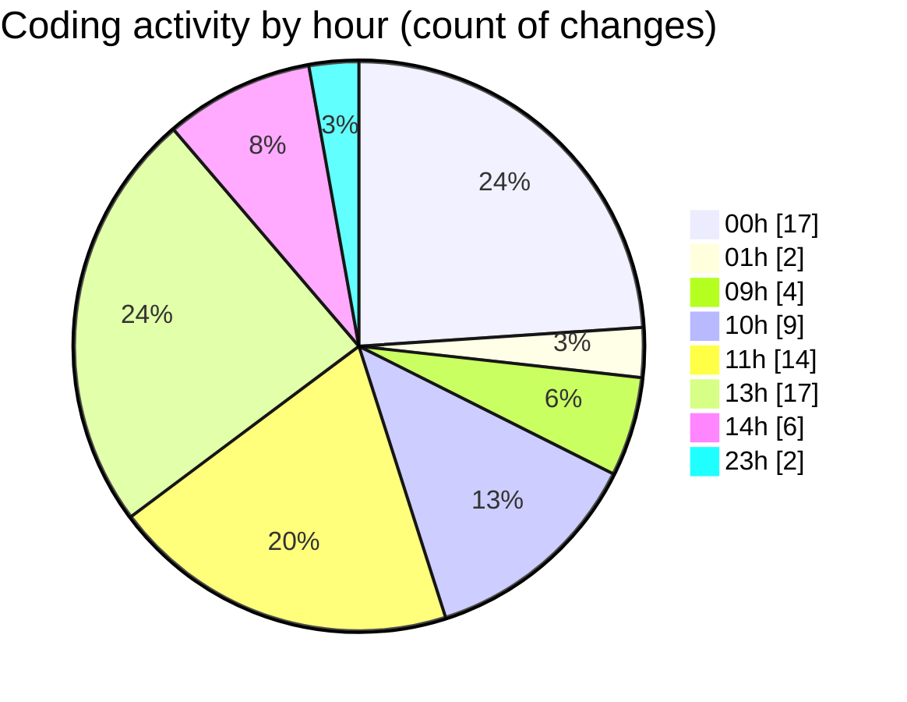

# eventscop-frontend-guide (Workspace) - Activity Summary 

## Overall Statistics

| Stat                   | Value                                                             |
| ---------------------- | ----------------------------------------------------------------- |
| **Lines Added** (➕)   | 1363                                          |
| **Lines Removed** (➖) | 192                                        |
| **Net Change** (↕)    | 1171                |
| **Active Time** (⌚)   | 100 minutes |

## Modified Files
- **fr.json** (+6, -0)
- **AuthenticationButtons.tsx** (+65, -0)
- **auth.ts** (+13, -0)
- **route.ts** (+81, -0)
- **Header.tsx** (+4, -4)
- **layout.tsx** (+8, -2)
- **HeaderCartButton.tsx** (+26, -0)
- **HeaderTopBar.tsx** (+5, -1)
- **crypto-vigenere.ts** (+0, -1)
- **.gitignore** (+79, -3)
- **biome.json** (+45, -1)
- **SupplierSearchClient.tsx** (+110, -84)
- **ActivitySearchClient.tsx** (+237, -82)
- **supplier-activities.ts** (+357, -2)
- **actions.ts** (+95, -12)
- **page.tsx** (+232, -0)

## Visualizations

### By File Type (Lines Changed)

### By Hour (Estimated Activity Count)

> **Last Updated:** 10/29/2025, 2:17:34 PM