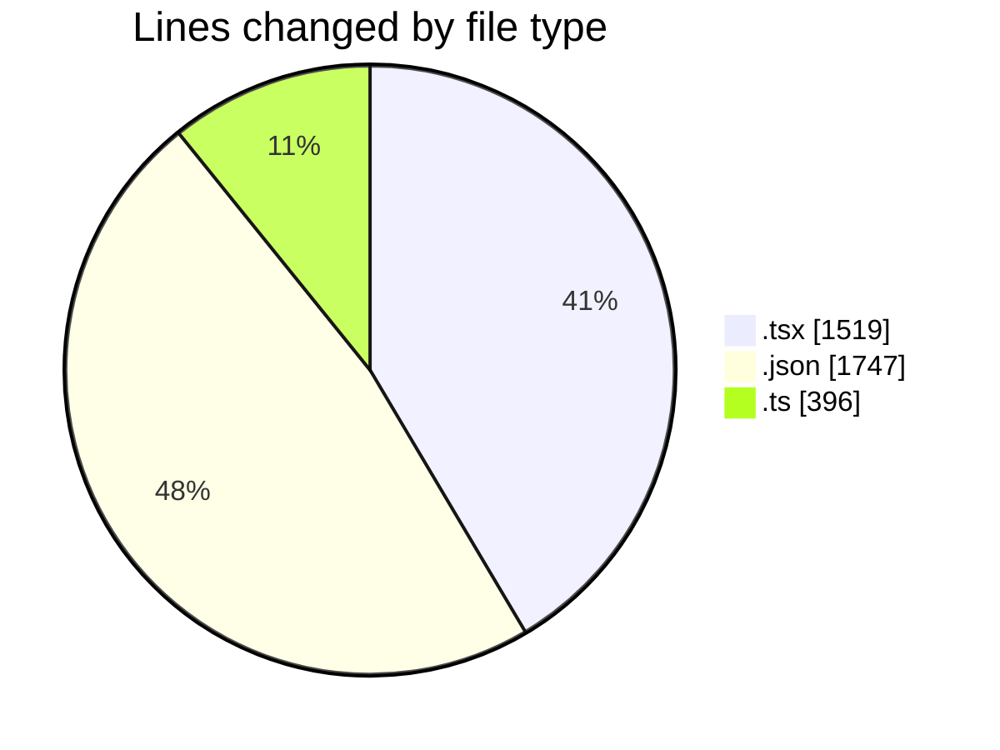
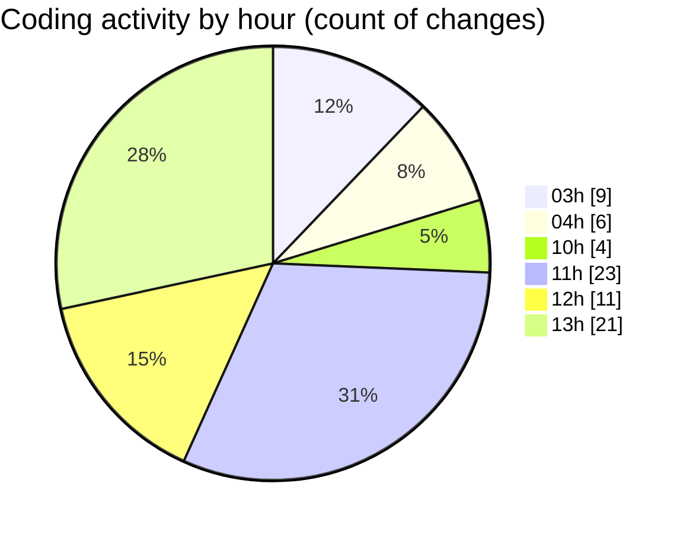

# eventscop-frontend-guide (Workspace) - Activity Summary 

## Overall Statistics

| Stat                   | Value                                                             |
| ---------------------- | ----------------------------------------------------------------- |
| **Lines Added** (➕)   | 3384                                          |
| **Lines Removed** (➖) | 278                                        |
| **Net Change** (↕)    | 3106                |
| **Active Time** (⌚)   | 129 minutes |

## Modified Files
- **SummaryAccommodation.tsx** (+44, -1)
- **fr.json** (+1746, -1)
- **NightItem.tsx** (+143, -2)
- **TimeRangeField.tsx** (+53, -0)
- **SummaryLocation.tsx** (+57, -1)
- **CartSummaryBrief.tsx** (+70, -0)
- **useCartSummarySync.ts** (+92, -0)
- **search-to-brief.ts** (+232, -72)
- **Brief.tsx** (+205, -180)
- **ResultsPagination.tsx** (+4, -3)
- **SearchPageForm.tsx** (+350, -2)
- **BriefSummaryItems.tsx** (+176, -16)
- **StepLocation.tsx** (+212, -0)

## Visualizations

### By File Type (Lines Changed)

### By Hour (Estimated Activity Count)

> **Last Updated:** 10/30/2025, 1:44:46 PM