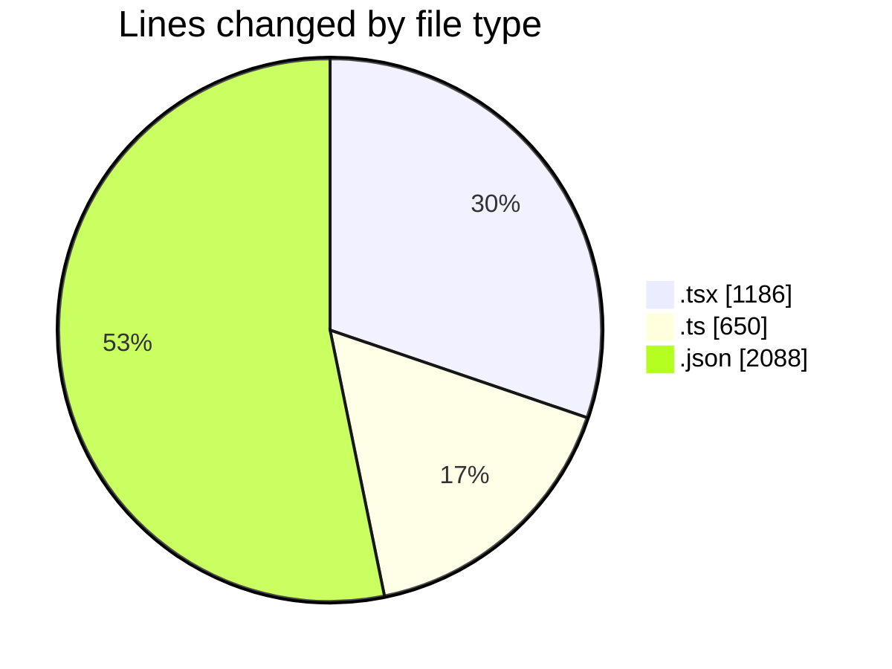
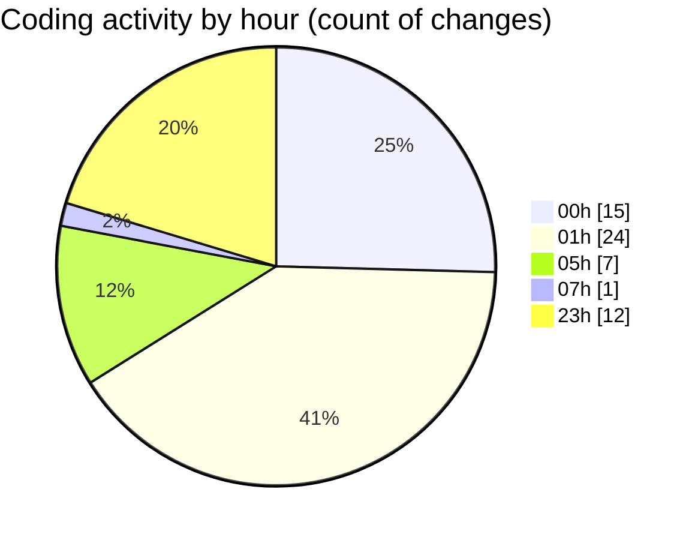

# eventscop-frontend-guide (Workspace) - Activity Summary 

## Overall Statistics

| Stat                   | Value                                                             |
| ---------------------- | ----------------------------------------------------------------- |
| **Lines Added** (➕)   | 3901                                          |
| **Lines Removed** (➖) | 23                                        |
| **Net Change** (↕)    | 3878                |
| **Active Time** (⌚)   | 97 minutes |

## Modified Files
- **EditorialSection.tsx** (+47, -5)
- **page.tsx** (+4, -3)
- **page.tsx** (+306, -0)
- **page.tsx** (+304, -0)
- **page.tsx** (+344, -0)
- **page.tsx** (+9, -1)
- **city.ts** (+241, -11)
- **fr.json** (+1791, -1)
- **settings.json** (+296, -0)
- **StepAccommodationDetails.tsx** (+162, -1)
- **brief.ts** (+209, -1)
- **useTeamBuildingForm.ts** (+148, -0)
- **useCateringGeneration.ts** (+40, -0)

## Visualizations

### By File Type (Lines Changed)

### By Hour (Estimated Activity Count)

> **Last Updated:** 10/31/2025, 7:55:23 AM