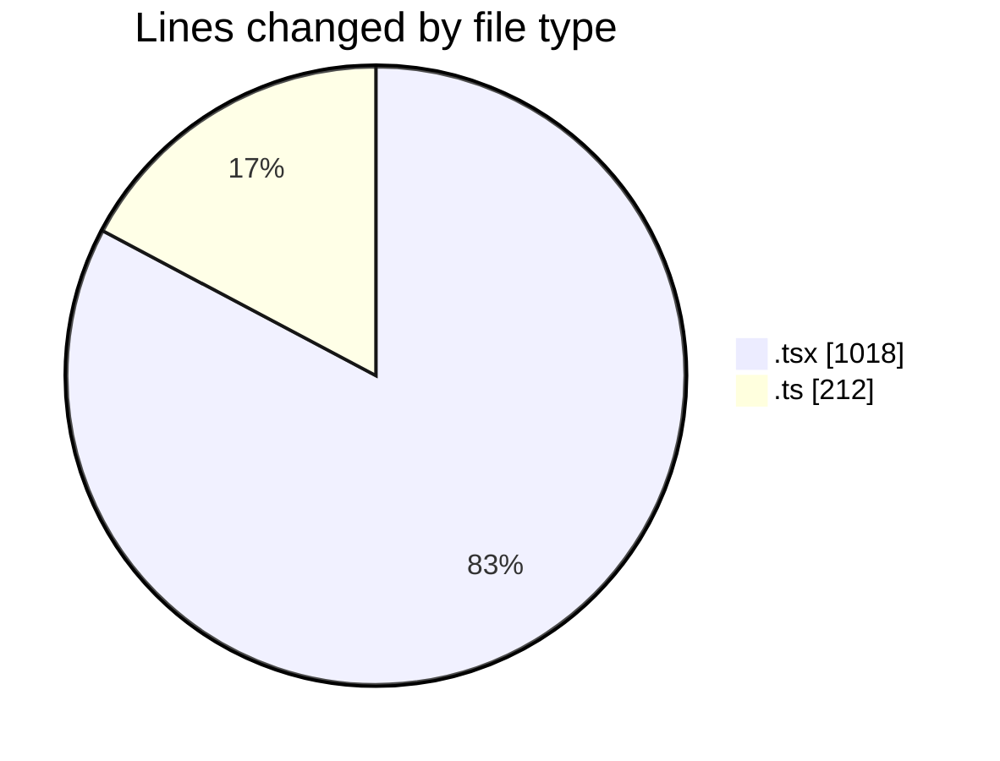
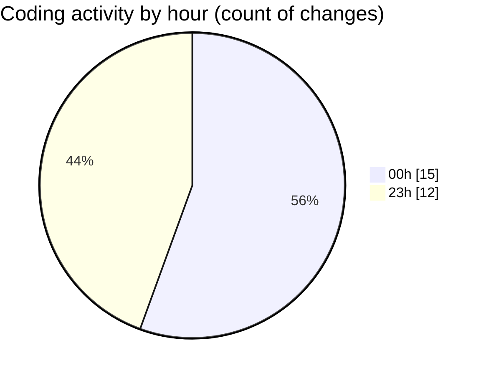

# eventscop-frontend-guide (Workspace) - Activity Summary 

## Overall Statistics

| Stat                   | Value                                                             |
| ---------------------- | ----------------------------------------------------------------- |
| **Lines Added** (➕)   | 1215                                          |
| **Lines Removed** (➖) | 15                                        |
| **Net Change** (↕)    | 1200                |
| **Active Time** (⌚)   | 37 minutes |

## Modified Files
- **EditorialSection.tsx** (+47, -5)
- **page.tsx** (+4, -3)
- **page.tsx** (+306, -0)
- **page.tsx** (+304, -0)
- **page.tsx** (+344, -0)
- **page.tsx** (+5, -0)
- **city.ts** (+205, -7)

## Visualizations

### By File Type (Lines Changed)

### By Hour (Estimated Activity Count)

> **Last Updated:** 10/31/2025, 12:55:21 AM