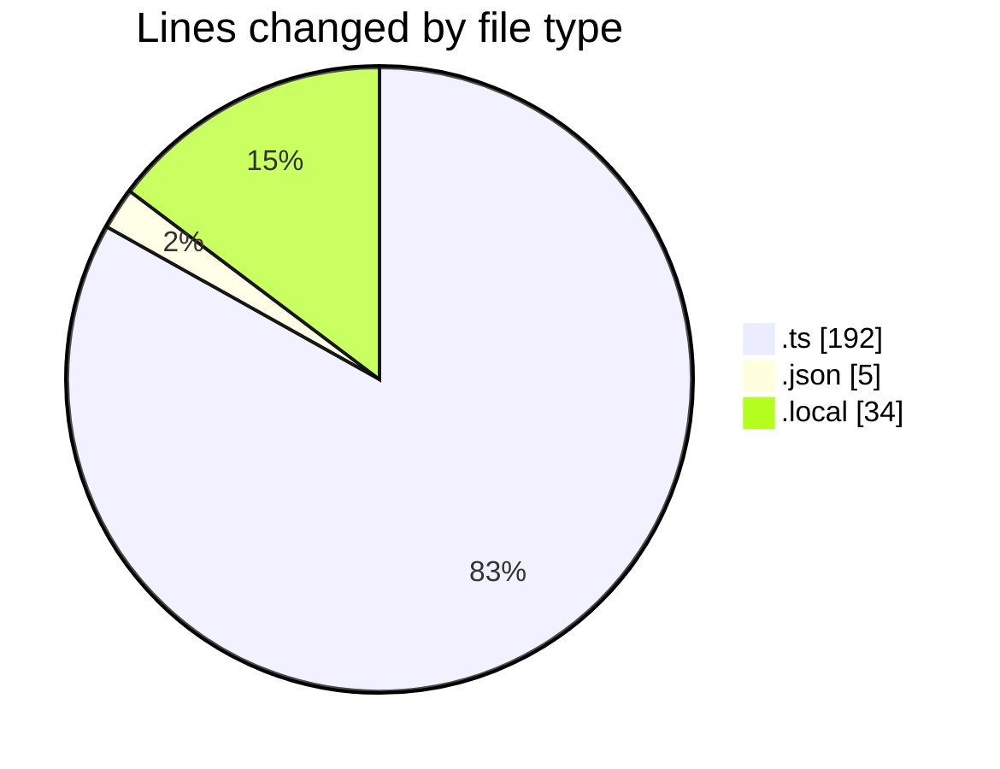
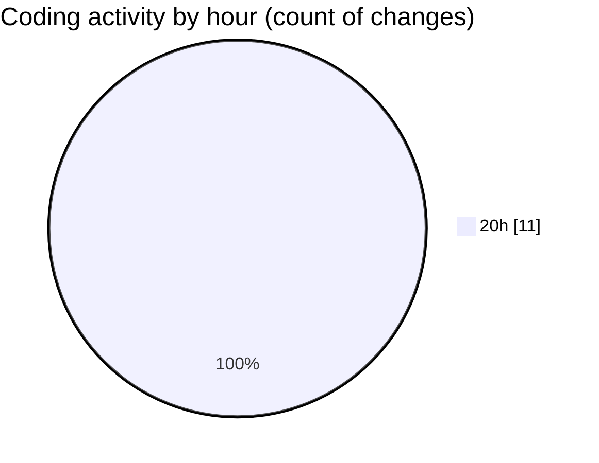

# temp_mr_252 - Activity Summary 

## Overall Statistics

| Stat                   | Value                                                             |
| ---------------------- | ----------------------------------------------------------------- |
| **Lines Added** (➕)   | 227                                          |
| **Lines Removed** (➖) | 4                                        |
| **Net Change** (↕)    | 223                |
| **Active Time** (⌚)   | 10 minutes |

## Modified Files
- **next.config.ts** (+69, -0)
- **package.json** (+3, -2)
- **plateforms.ts** (+44, -1)
- **api-fetch.ts** (+77, -1)
- **.env.local** (+34, -0)

## Visualizations

### By File Type (Lines Changed)

### By Hour (Estimated Activity Count)

> **Last Updated:** 10/31/2025, 8:16:17 PM