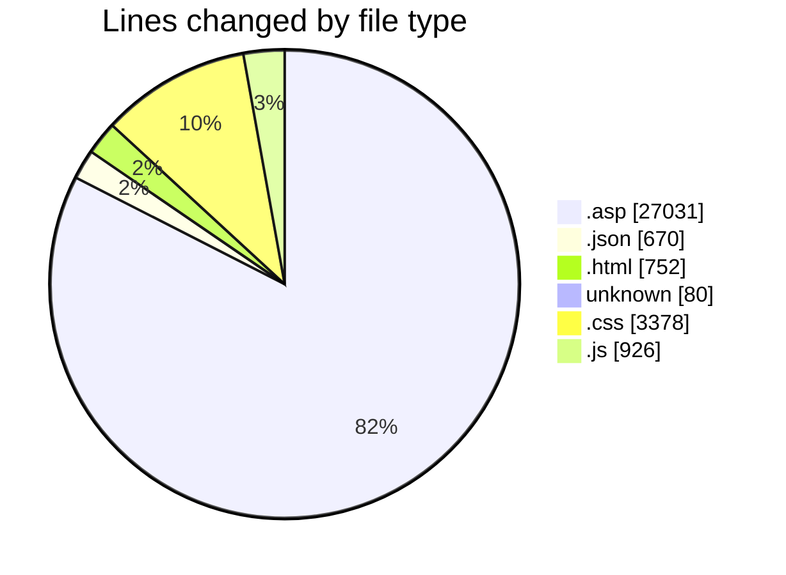
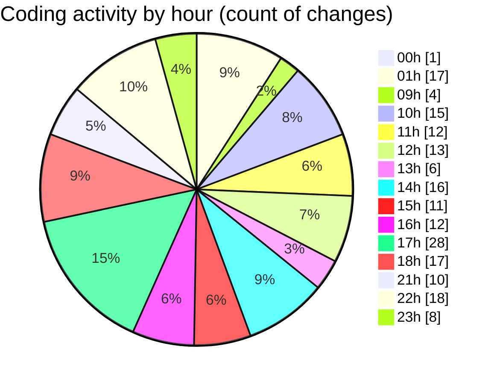

# cdp.aleoudev.fr (Workspace) - Activity Summary 

## Overall Statistics

| Stat                   | Value                                                             |
| ---------------------- | ----------------------------------------------------------------- |
| **Lines Added** (➕)   | 32519                                          |
| **Lines Removed** (➖) | 318                                        |
| **Net Change** (↕)    | 32201                |
| **Active Time** (⌚)   | 290 minutes |

## Modified Files
- **virtuatab.asp** (+485, -0)
- **demande_step_0_view.asp** (+1071, -1)
- **demande_step_0.asp** (+5745, -218)
- **functions.asp** (+0, -1)
- **demande_action_db.asp** (+3959, -0)
- **data-load.asp** (+8767, -0)
- **search.asp** (+1204, -2)
- **settings.json** (+297, -1)
- **keybindings.json** (+72, -0)
- **demande_step_5.asp** (+3406, -0)
- **src_tags.json** (+150, -0)
- **home.asp** (+831, -55)
- **index.html** (+752, -0)
- **xinc.asp** (+1273, -13)
- **.htaccess** (+80, -0)
- **tags.json** (+150, -0)
- **main.css** (+3010, -12)
- **amsify.suggestags.css** (+216, -14)
- **jquery.amsify.suggestags.js** (+926, -0)
- **tagify-custom.css** (+125, -1)

## Visualizations

### By File Type (Lines Changed)

### By Hour (Estimated Activity Count)

> **Last Updated:** 11/1/2025, 11:25:19 PM