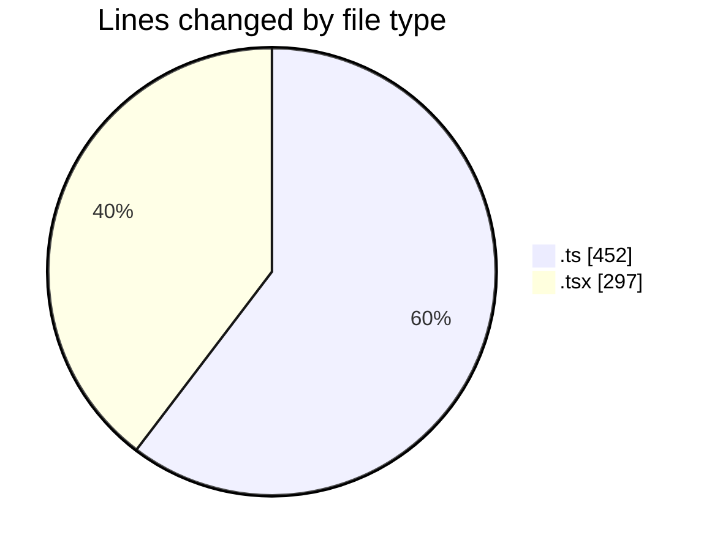
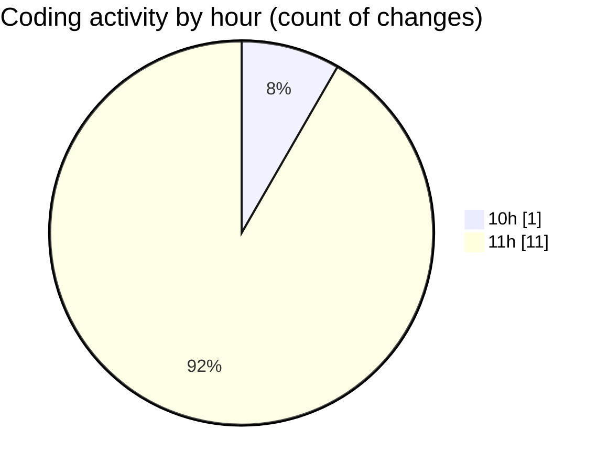

# eventscop-frontend-guide (Workspace) - Activity Summary 

## Overall Statistics

| Stat                   | Value                                                             |
| ---------------------- | ----------------------------------------------------------------- |
| **Lines Added** (➕)   | 667                                          |
| **Lines Removed** (➖) | 82                                        |
| **Net Change** (↕)    | 585                |
| **Active Time** (⌚)   | 11 minutes |

## Modified Files
- **title-generator.ts** (+390, -0)
- **SupplierSearchContainer.tsx** (+215, -82)
- **search-components.ts** (+62, -0)

## Visualizations

### By File Type (Lines Changed)

### By Hour (Estimated Activity Count)

> **Last Updated:** 11/3/2025, 11:30:36 AM