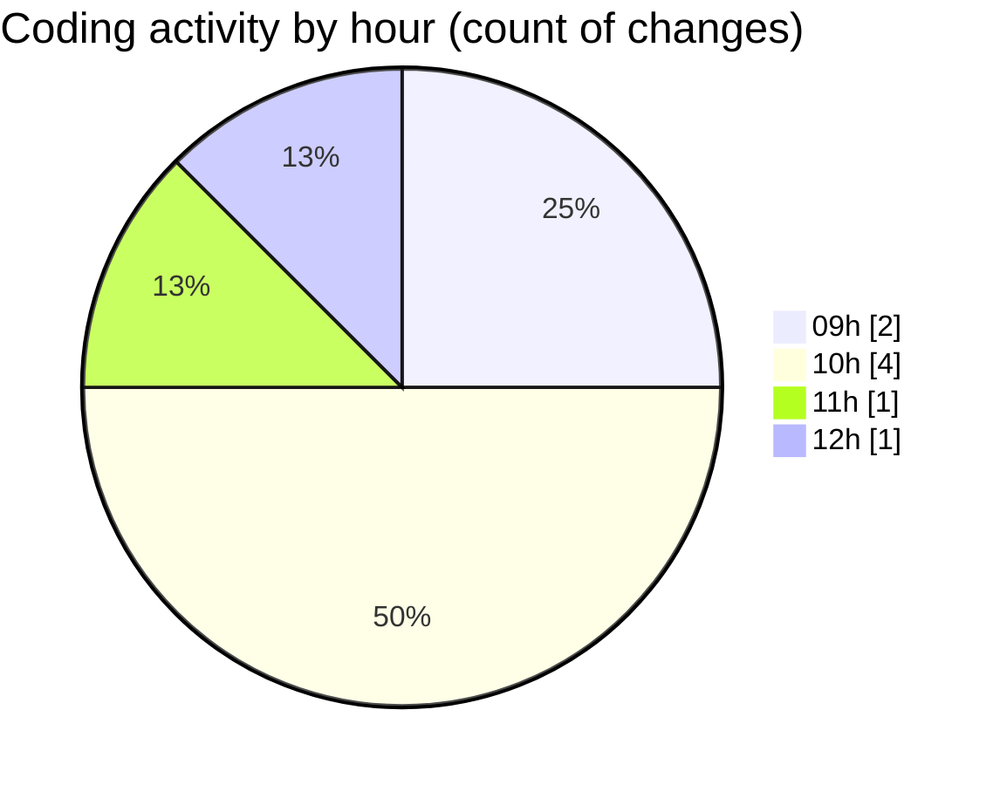

# eventscop-api-guide (Workspace) - Activity Summary 

## Overall Statistics

| Stat                   | Value                                                             |
| ---------------------- | ----------------------------------------------------------------- |
| **Lines Added** (➕)   | 947                                          |
| **Lines Removed** (➖) | 1                                        |
| **Net Change** (↕)    | 946                |
| **Active Time** (⌚)   | 10 minutes |

## Modified Files
- **brief_schemas.py** (+351, -1)
- **routes.py** (+596, -0)

## Visualizations

### By File Type (Lines Changed)

### By Hour (Estimated Activity Count)

> **Last Updated:** 11/4/2025, 12:14:34 PM