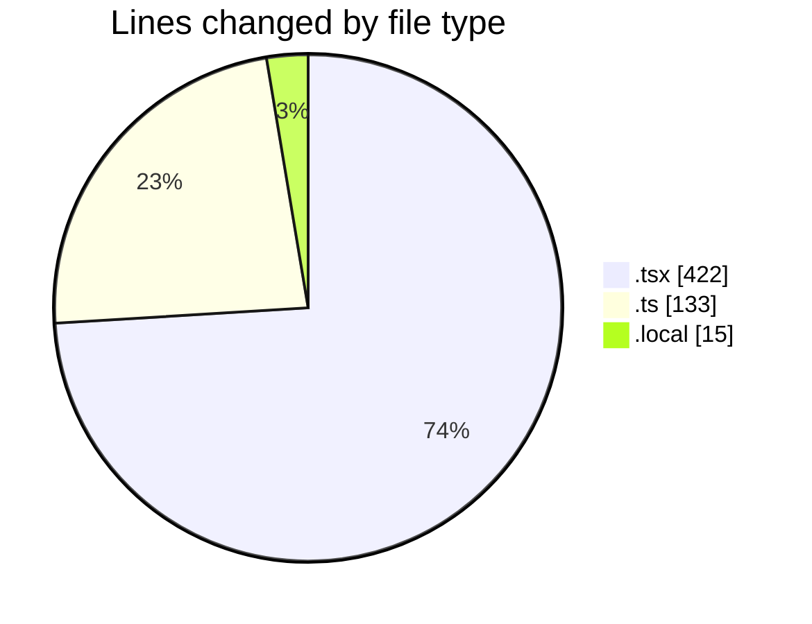
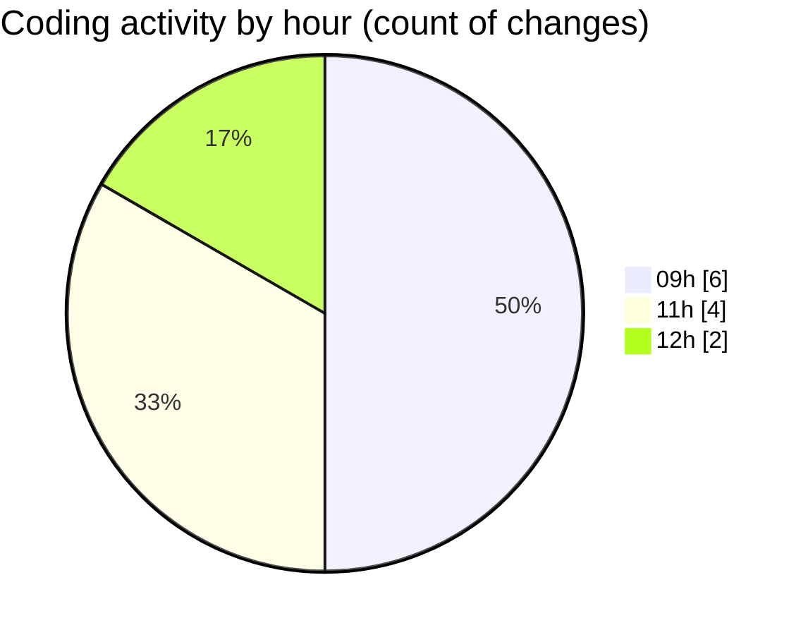

# eventscop-frontend-guide (Workspace) - Activity Summary 

## Overall Statistics

| Stat                   | Value                                                             |
| ---------------------- | ----------------------------------------------------------------- |
| **Lines Added** (➕)   | 427                                          |
| **Lines Removed** (➖) | 143                                        |
| **Net Change** (↕)    | 284                |
| **Active Time** (⌚)   | 9 minutes |

## Modified Files
- **SupplierSearchClient.tsx** (+96, -96)
- **SupplierSearchContainer.tsx** (+44, -44)
- **search-components.ts** (+3, -3)
- **next.config.ts** (+127, -0)
- **.env.local** (+15, -0)
- **TeamBuildingObjectives.tsx** (+65, -0)
- **TeamBuildingTheme.tsx** (+77, -0)

## Visualizations

### By File Type (Lines Changed)

### By Hour (Estimated Activity Count)

> **Last Updated:** 11/4/2025, 12:55:36 PM