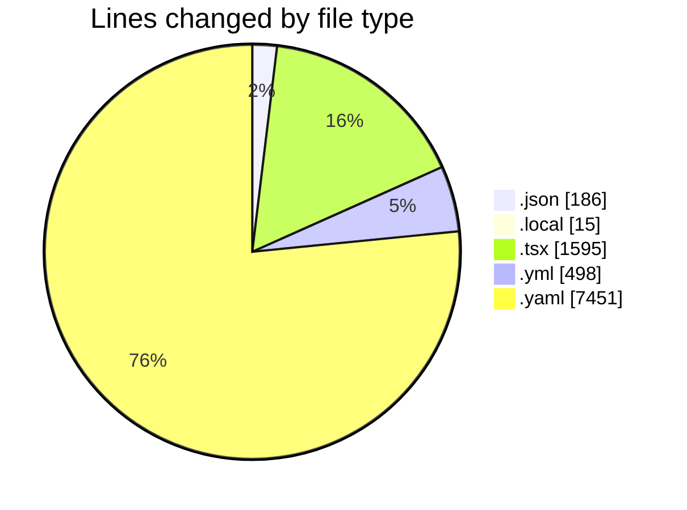
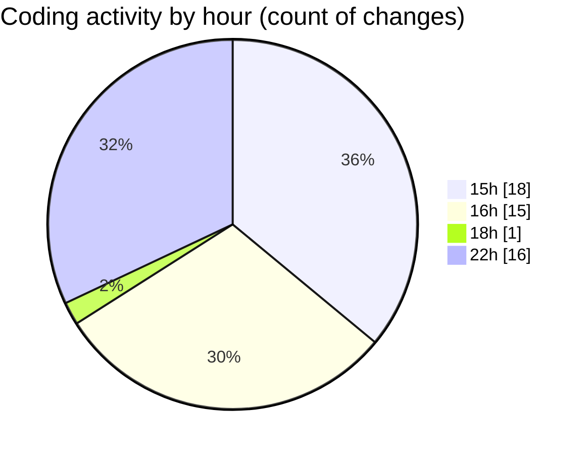

# eventscop-frontend-guide (Workspace) - Activity Summary 

## Overall Statistics

| Stat                   | Value                                                             |
| ---------------------- | ----------------------------------------------------------------- |
| **Lines Added** (➕)   | 8241                                          |
| **Lines Removed** (➖) | 1504                                        |
| **Net Change** (↕)    | 6737                |
| **Active Time** (⌚)   | 47 minutes |

## Modified Files
- **package.json** (+3, -2)
- **.env.local** (+15, -0)
- **TeamBuildingTheme.tsx** (+210, -132)
- **package.json** (+145, -36)
- **.gitlab-ci.yml** (+264, -234)
- **pnpm-lock.yaml** (+6426, -1025)
- **PlaceCard.tsx** (+144, -0)
- **page.tsx** (+166, -8)
- **page.tsx** (+110, -8)
- **page.tsx** (+107, -8)
- **StepCateringDetails.tsx** (+123, -9)
- **StepContact.tsx** (+248, -5)
- **StepPrestation.tsx** (+172, -17)
- **PostalCodeTags.tsx** (+108, -20)

## Visualizations

### By File Type (Lines Changed)

### By Hour (Estimated Activity Count)

> **Last Updated:** 11/5/2025, 10:02:06 PM