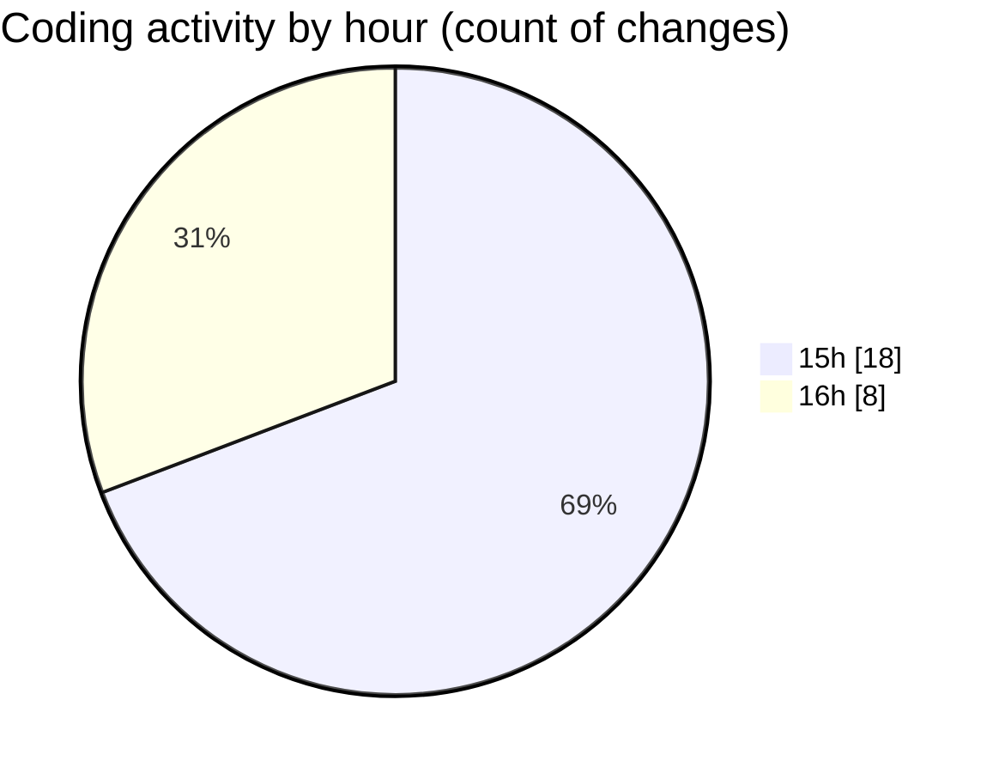

# eventscop-frontend-guide (Workspace) - Activity Summary 

## Overall Statistics

| Stat                   | Value                                                             |
| ---------------------- | ----------------------------------------------------------------- |
| **Lines Added** (➕)   | 6899                                          |
| **Lines Removed** (➖) | 1367                                        |
| **Net Change** (↕)    | 5532                |
| **Active Time** (⌚)   | 23 minutes |

## Modified Files
- **package.json** (+3, -2)
- **.env.local** (+15, -0)
- **TeamBuildingTheme.tsx** (+210, -132)
- **package.json** (+145, -26)
- **.gitlab-ci.yml** (+264, -234)
- **pnpm-lock.yaml** (+6262, -973)

## Visualizations

### By File Type (Lines Changed)

### By Hour (Estimated Activity Count)

> **Last Updated:** 11/5/2025, 4:25:21 PM