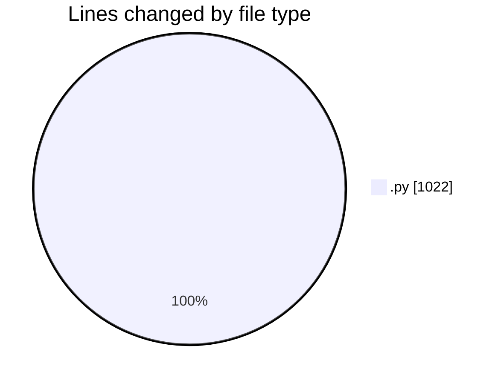
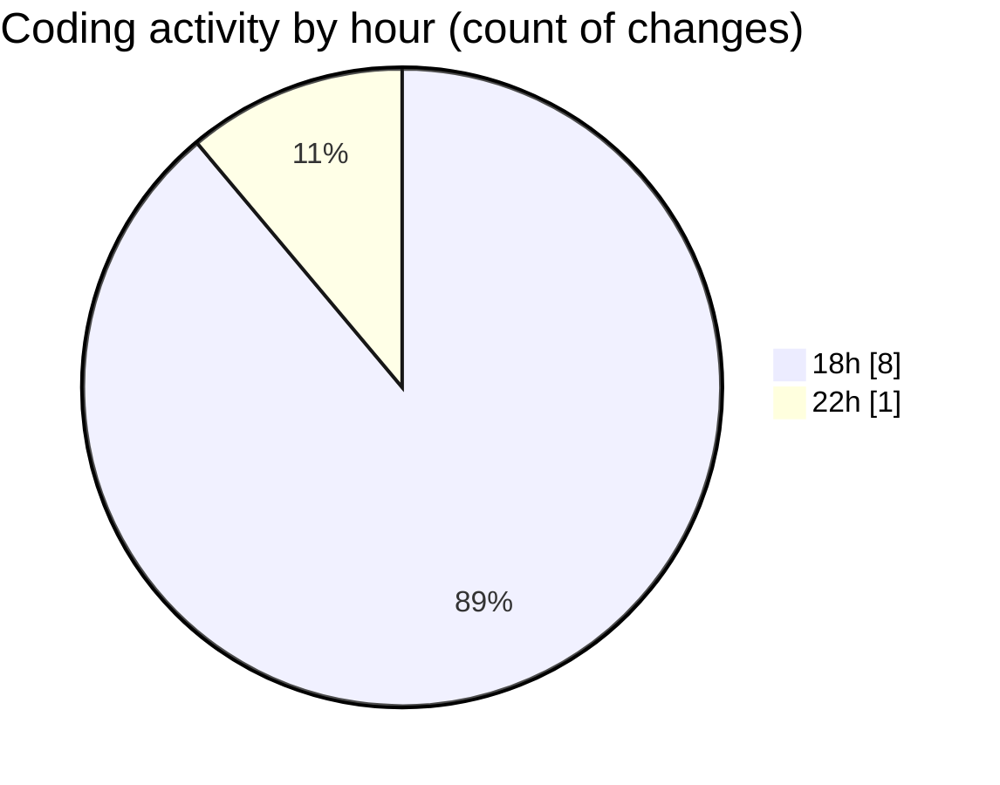

# eventscop-api-guide (Workspace) - Activity Summary 

## Overall Statistics

| Stat                   | Value                                                             |
| ---------------------- | ----------------------------------------------------------------- |
| **Lines Added** (➕)   | 1019                                          |
| **Lines Removed** (➖) | 3                                        |
| **Net Change** (↕)    | 1016                |
| **Active Time** (⌚)   | 9 minutes |

## Modified Files
- **routes.py** (+133, -3)
- **main.py** (+259, -0)
- **schemas.py** (+43, -0)
- **routes.py** (+584, -0)

## Visualizations

### By File Type (Lines Changed)

### By Hour (Estimated Activity Count)

> **Last Updated:** 11/7/2025, 10:36:07 PM