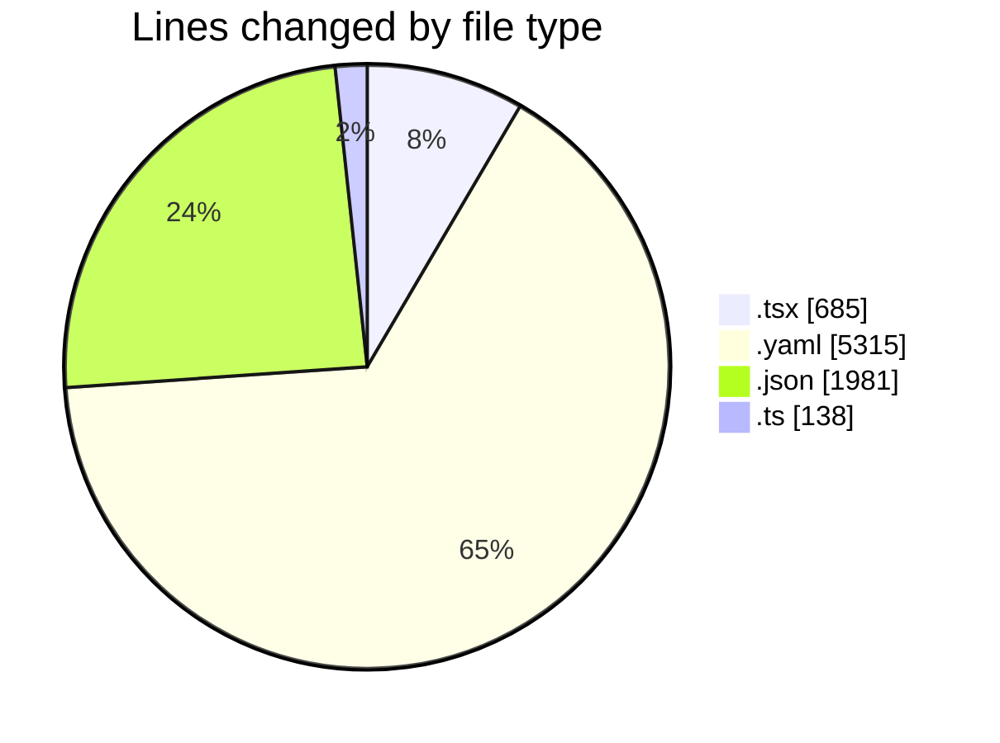
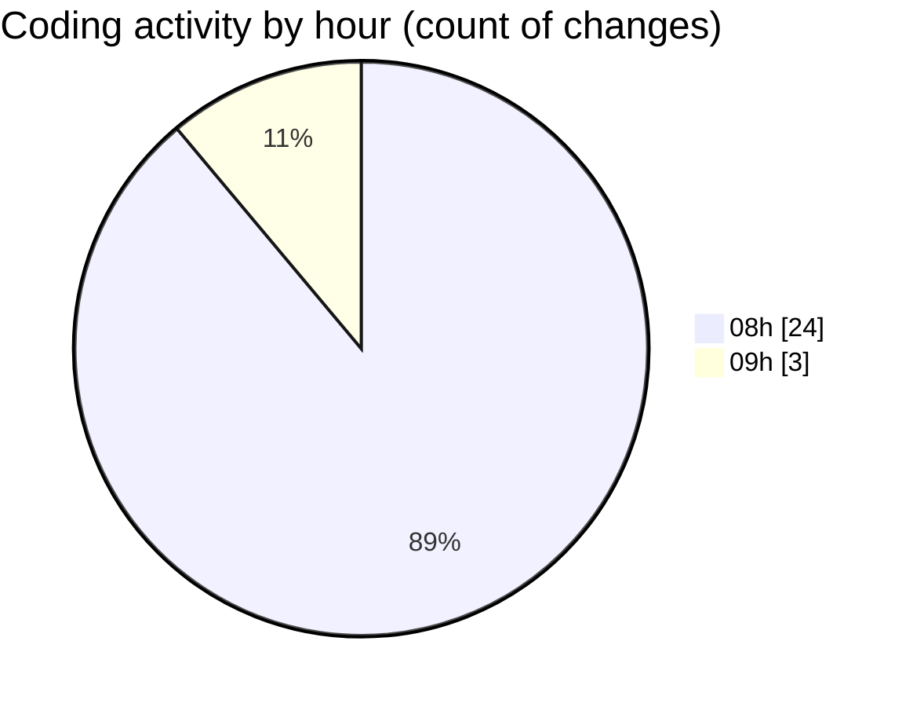

# eventscop-frontend-guide (Workspace) - Activity Summary 

## Overall Statistics

| Stat                   | Value                                                             |
| ---------------------- | ----------------------------------------------------------------- |
| **Lines Added** (➕)   | 7988                                          |
| **Lines Removed** (➖) | 131                                        |
| **Net Change** (↕)    | 7857                |
| **Active Time** (⌚)   | 25 minutes |

## Modified Files
- **ReviewsCategoryRatings.tsx** (+15, -15)
- **OrganizeSubmenu.tsx** (+5, -5)
- **pnpm-lock.yaml** (+5315, -0)
- **page.tsx** (+108, -6)
- **StepCateringDetails.tsx** (+123, -9)
- **biome.json** (+164, -40)
- **StepPrestation.tsx** (+187, -32)
- **SeoErrorBoundary.tsx** (+156, -24)
- **fr.json** (+1777, -0)
- **footer.ts** (+138, -0)

## Visualizations

### By File Type (Lines Changed)

### By Hour (Estimated Activity Count)

> **Last Updated:** 11/7/2025, 9:59:57 AM