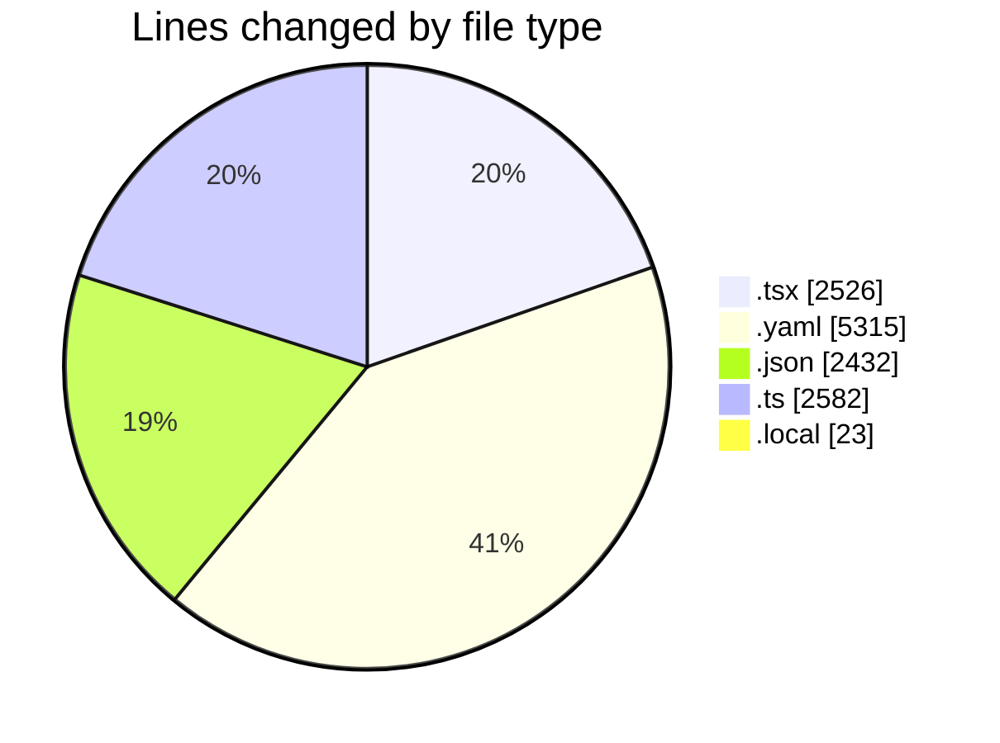
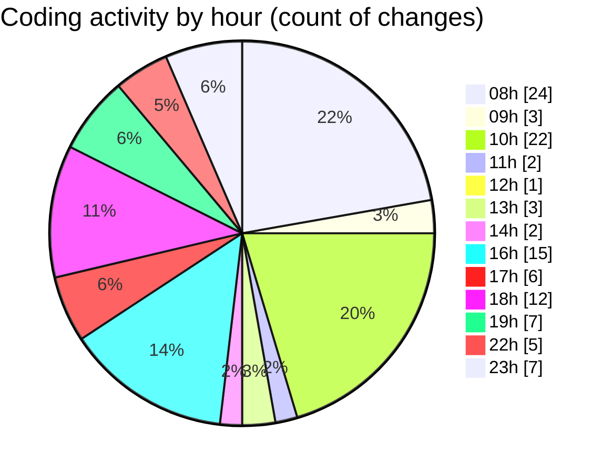

# eventscop-frontend-guide (Workspace) - Activity Summary 

## Overall Statistics

| Stat                   | Value                                                             |
| ---------------------- | ----------------------------------------------------------------- |
| **Lines Added** (➕)   | 12544                                          |
| **Lines Removed** (➖) | 334                                        |
| **Net Change** (↕)    | 12210                |
| **Active Time** (⌚)   | 113 minutes |

## Modified Files
- **ReviewsCategoryRatings.tsx** (+15, -15)
- **OrganizeSubmenu.tsx** (+5, -5)
- **pnpm-lock.yaml** (+5315, -0)
- **page.tsx** (+108, -6)
- **StepCateringDetails.tsx** (+123, -9)
- **biome.json** (+289, -41)
- **StepPrestation.tsx** (+187, -32)
- **SeoErrorBoundary.tsx** (+156, -24)
- **fr.json** (+1777, -0)
- **footer.ts** (+161, -22)
- **FooterSection.tsx** (+37, -3)
- **Footer.tsx** (+88, -5)
- **LinkdeinIcon.tsx** (+25, -1)
- **package.json** (+3, -0)
- **.claude.json** (+276, -0)
- **settings.json** (+41, -5)
- **CivilityField.tsx** (+49, -0)
- **ProviderQuoteForm.tsx** (+71, -0)
- **ParticipantsField.tsx** (+45, -5)
- **page.tsx** (+175, -17)
- **AddReviewModal.tsx** (+283, -0)
- **useSearchSync.ts** (+204, -0)
- **SupplierSearchClient.tsx** (+66, -1)
- **useSupplierSearch.ts** (+59, -3)
- **SupplierSearchContainer.tsx** (+116, -2)
- **page.tsx** (+346, -68)
- **useSearch.ts** (+242, -0)
- **route.ts** (+131, -22)
- **.env.local** (+23, -0)
- **contact.ts** (+22, -0)
- **suppliers.ts** (+485, -0)
- **CompleteYourCartItem.tsx** (+90, -38)
- **searchHelpers.ts** (+221, -0)
- **useBriefReset.ts** (+46, -0)
- **ReviewsModal.tsx** (+111, -0)
- **page.tsx** (+141, -0)
- **departments.ts** (+954, -10)
- **ActivityMapAccessDescription.tsx** (+58, -0)

## Visualizations

### By File Type (Lines Changed)

### By Hour (Estimated Activity Count)

> **Last Updated:** 11/7/2025, 11:59:58 PM