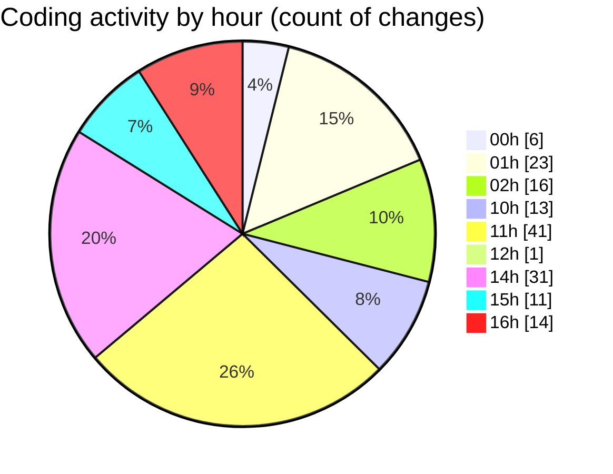

# eventscop-frontend-guide (Workspace) - Activity Summary 

## Overall Statistics

| Stat                   | Value                                                             |
| ---------------------- | ----------------------------------------------------------------- |
| **Lines Added** (➕)   | 4498                                          |
| **Lines Removed** (➖) | 154                                        |
| **Net Change** (↕)    | 4344                |
| **Active Time** (⌚)   | 246 minutes |

## Modified Files
- **FranceMap.tsx** (+158, -3)
- **page.tsx** (+2, -1)
- **FiltersModal.tsx** (+75, -0)
- **filter-helpers.ts** (+70, -0)
- **useFilterContainer.ts** (+78, -0)
- **next.config.ts** (+149, -28)
- **package.json** (+111, -0)
- **SummarySection.tsx** (+67, -14)
- **PresentationSection.tsx** (+44, -3)
- **page.tsx** (+422, -0)
- **PlaceCard.tsx** (+133, -0)
- **page.tsx** (+239, -1)
- **SupplierHighlightBanner.tsx** (+85, -38)
- **common.ts** (+283, -1)
- **SupplierHighlightCarousel.tsx** (+165, -11)
- **page.tsx** (+83, -1)
- **page.tsx** (+117, -1)
- **page.tsx** (+95, -2)
- **page.tsx** (+97, -0)
- **page.tsx** (+110, -0)
- **page.tsx** (+124, -0)
- **page.tsx** (+71, -1)
- **page.tsx** (+395, -0)
- **MapView.tsx** (+66, -0)
- **AuthenticationButtons.tsx** (+62, -1)
- **HeaderTopBar.tsx** (+30, -0)
- **Header.tsx** (+35, -1)
- **layout.tsx** (+30, -1)
- **SignupFormContainer.tsx** (+37, -1)
- **auth.ts** (+124, -2)
- **SignupIllustrationSection.tsx** (+16, -0)
- **page.tsx** (+49, -1)
- **TermsAcceptance.tsx** (+61, -10)
- **routing.ts** (+218, -4)
- **useActivitySearch.ts** (+54, -0)
- **useSearchResultsCounter.ts** (+76, -0)
- **server-helpers.ts** (+48, -0)
- **district-helpers.ts** (+47, -0)
- **route.ts** (+50, -7)
- **.env.local** (+4, -0)
- **auth.ts** (+118, -19)
- **useLoginForm.ts** (+68, -1)
- **SocialLoginButtons.tsx** (+50, -1)
- **LoginForm.tsx** (+82, -0)

## Visualizations

### By File Type (Lines Changed)

### By Hour (Estimated Activity Count)

> **Last Updated:** 11/8/2025, 4:55:01 PM