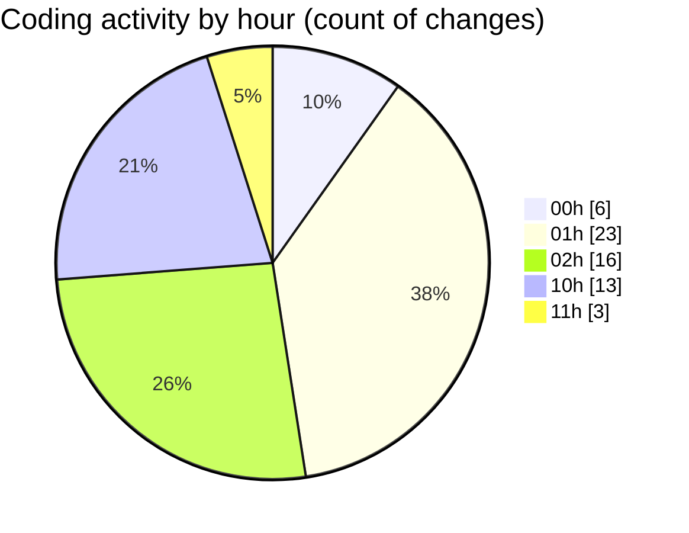

# eventscop-frontend-guide (Workspace) - Activity Summary 

## Overall Statistics

| Stat                   | Value                                                             |
| ---------------------- | ----------------------------------------------------------------- |
| **Lines Added** (➕)   | 2022                                          |
| **Lines Removed** (➖) | 64                                        |
| **Net Change** (↕)    | 1958                |
| **Active Time** (⌚)   | 92 minutes |

## Modified Files
- **FranceMap.tsx** (+158, -3)
- **page.tsx** (+2, -1)
- **FiltersModal.tsx** (+75, -0)
- **filter-helpers.ts** (+70, -0)
- **useFilterContainer.ts** (+78, -0)
- **next.config.ts** (+149, -28)
- **package.json** (+111, -0)
- **SummarySection.tsx** (+67, -14)
- **PresentationSection.tsx** (+44, -3)
- **page.tsx** (+422, -0)
- **PlaceCard.tsx** (+133, -0)
- **page.tsx** (+238, -0)
- **SupplierHighlightBanner.tsx** (+76, -10)
- **common.ts** (+266, -0)
- **SupplierHighlightCarousel.tsx** (+133, -5)

## Visualizations

### By File Type (Lines Changed)

### By Hour (Estimated Activity Count)

> **Last Updated:** 11/8/2025, 11:10:01 AM