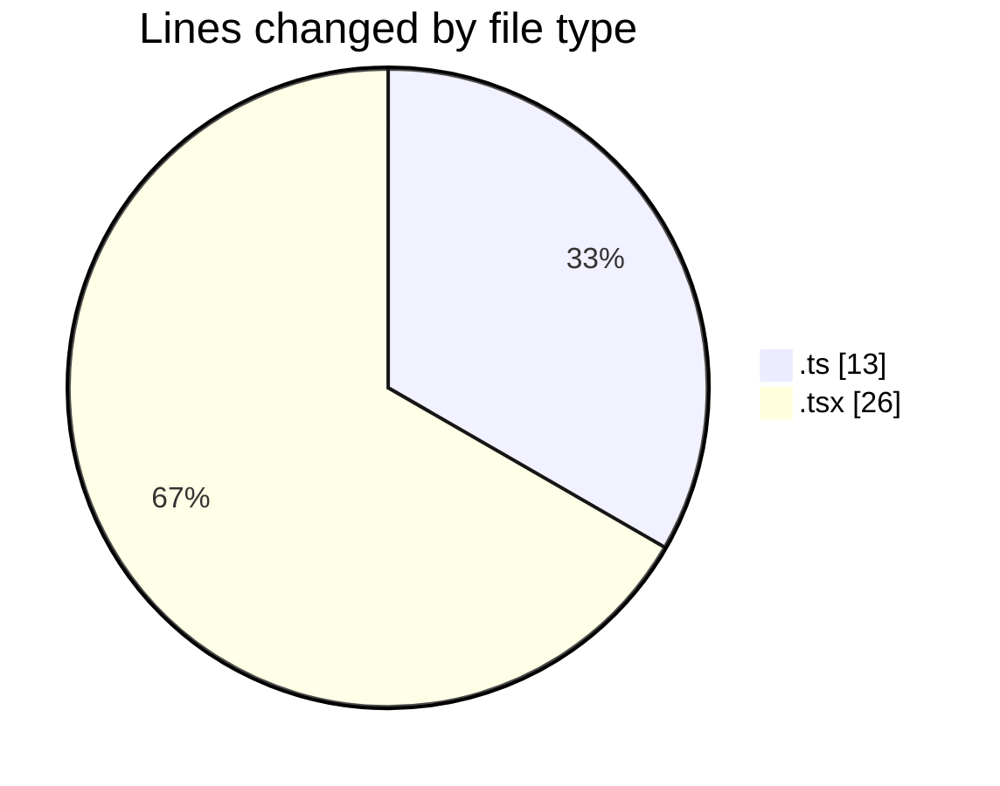
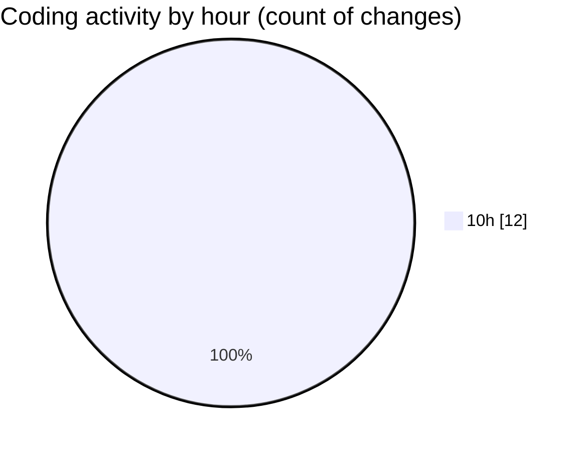

# eventscop-frontend-guide (Workspace) - Activity Summary 

## Overall Statistics

| Stat                   | Value                                                             |
| ---------------------- | ----------------------------------------------------------------- |
| **Lines Added** (➕)   | 16                                          |
| **Lines Removed** (➖) | 23                                        |
| **Net Change** (↕)    | -7                |
| **Active Time** (⌚)   | 8 minutes |

## Modified Files
- **route.ts** (+4, -0)
- **next.config.ts** (+4, -5)
- **LoginForm.tsx** (+2, -8)
- **SummarySection.tsx** (+0, -10)
- **AuthenticationButtons.tsx** (+1, -0)
- **TermsAcceptance.tsx** (+4, -0)
- **SocialLoginButtons.tsx** (+1, -0)

## Visualizations

### By File Type (Lines Changed)

### By Hour (Estimated Activity Count)

> **Last Updated:** 11/9/2025, 10:45:05 AM