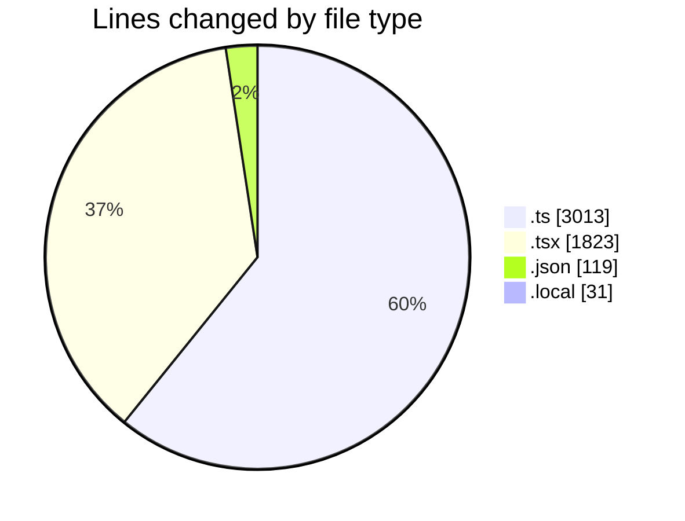
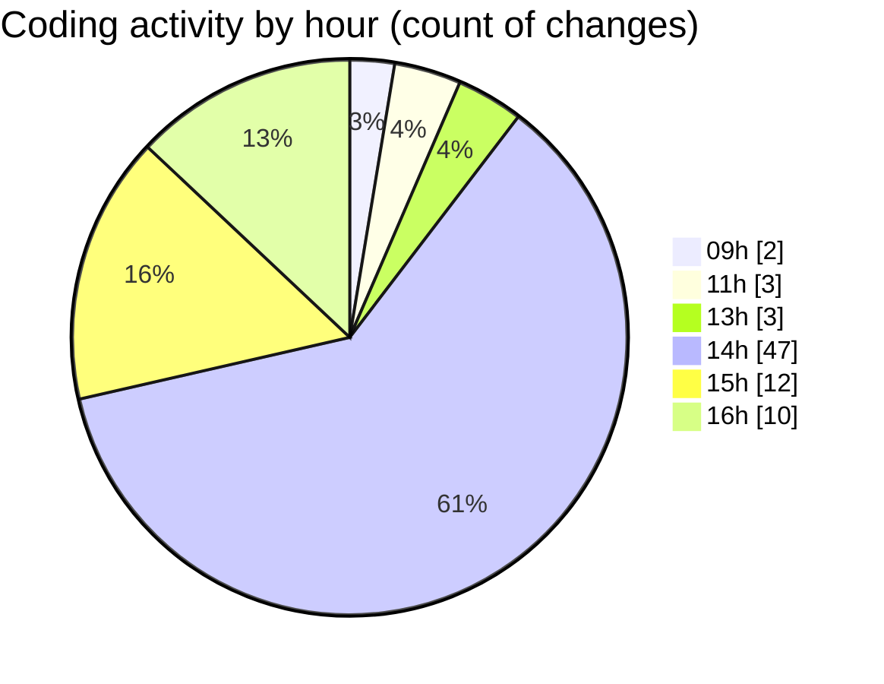

# eventscop-frontend-guide (Workspace) - Activity Summary 

## Overall Statistics

| Stat                   | Value                                                             |
| ---------------------- | ----------------------------------------------------------------- |
| **Lines Added** (➕)   | 4895                                          |
| **Lines Removed** (➖) | 91                                        |
| **Net Change** (↕)    | 4804                |
| **Active Time** (⌚)   | 89 minutes |

## Modified Files
- **auth.ts** (+199, -0)
- **next.config.ts** (+123, -2)
- **page.tsx** (+329, -51)
- **package.json** (+111, -0)
- **package.json** (+6, -2)
- **ReviewsModal.tsx** (+113, -4)
- **SupplierHighlightBanner.tsx** (+49, -0)
- **page.tsx** (+123, -0)
- **page.tsx** (+95, -0)
- **page.tsx** (+165, -0)
- **page.tsx** (+67, -0)
- **page.tsx** (+56, -0)
- **route.ts** (+37, -0)
- **route.ts** (+79, -0)
- **StepContact.tsx** (+244, -0)
- **captcha.tsx** (+123, -0)
- **useBriefSubmission.ts** (+58, -0)
- **cart-to-search.ts** (+116, -0)
- **cookies.ts** (+50, -0)
- **crypto-vigenere.ts** (+152, -0)
- **supplier.ts** (+80, -0)
- **searchHelpers.ts** (+223, -0)
- **utils.ts** (+111, -0)
- **AddReviewModal.tsx** (+284, -0)
- **.env.local** (+31, -0)
- **route.ts** (+48, -0)
- **useLoginForm.ts** (+79, -0)
- **departments.ts** (+951, -0)
- **constants.ts** (+49, -0)
- **suppliers.ts** (+485, -14)
- **footer.ts** (+139, -18)
- **ReviewInfoFields.tsx** (+120, -0)

## Visualizations

### By File Type (Lines Changed)

### By Hour (Estimated Activity Count)

> **Last Updated:** 11/10/2025, 4:20:13 PM