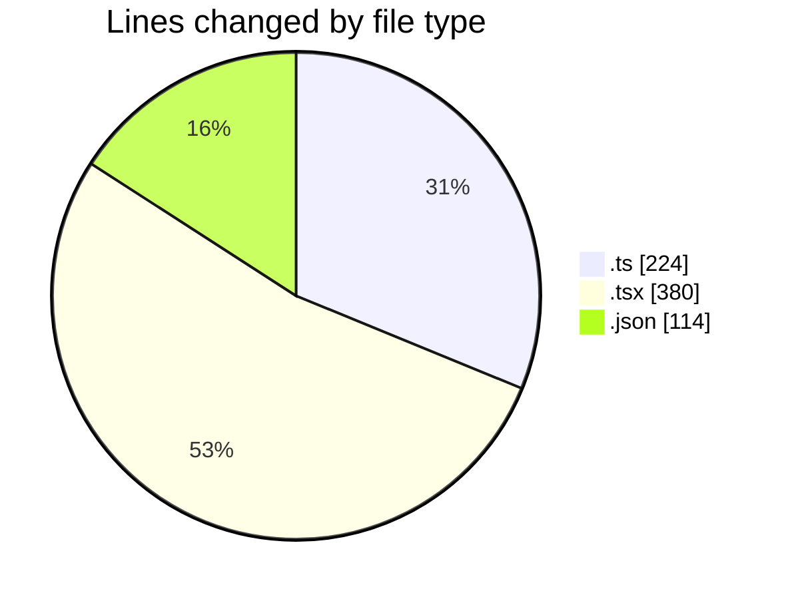
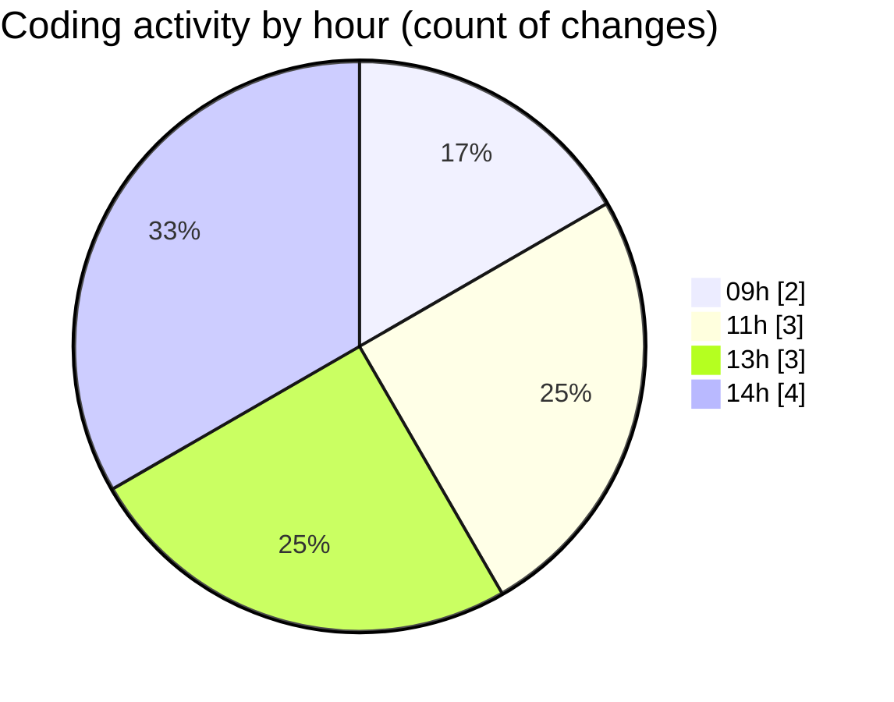

# eventscop-frontend-guide (Workspace) - Activity Summary 

## Overall Statistics

| Stat                   | Value                                                             |
| ---------------------- | ----------------------------------------------------------------- |
| **Lines Added** (➕)   | 665                                          |
| **Lines Removed** (➖) | 53                                        |
| **Net Change** (↕)    | 612                |
| **Active Time** (⌚)   | 2 minutes |

## Modified Files
- **auth.ts** (+99, -0)
- **next.config.ts** (+123, -2)
- **page.tsx** (+329, -51)
- **package.json** (+111, -0)
- **package.json** (+3, -0)

## Visualizations

### By File Type (Lines Changed)

### By Hour (Estimated Activity Count)

> **Last Updated:** 11/10/2025, 2:16:23 PM