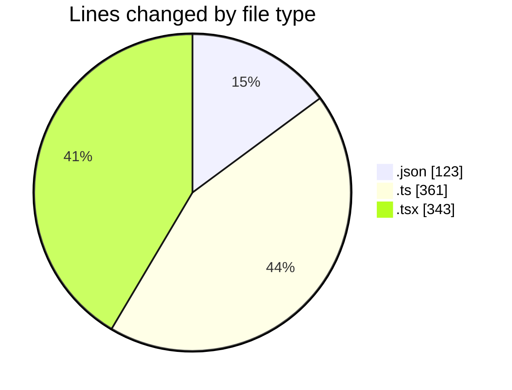

# eventscop-frontend-guide (Workspace) - Activity Summary 

## Overall Statistics

| Stat                   | Value                                                             |
| ---------------------- | ----------------------------------------------------------------- |
| **Lines Added** (➕)   | 819                                          |
| **Lines Removed** (➖) | 8                                        |
| **Net Change** (↕)    | 811                |
| **Active Time** (⌚)   | 11 minutes |

## Modified Files
- **package.json** (+5, -4)
- **package.json** (+113, -1)
- **referenced-entities.ts** (+115, -0)
- **page.tsx** (+343, -0)
- **searchHelpers.ts** (+243, -3)

## Visualizations

### By File Type (Lines Changed)

### By Hour (Estimated Activity Count)

> **Last Updated:** 11/12/2025, 9:34:26 AM