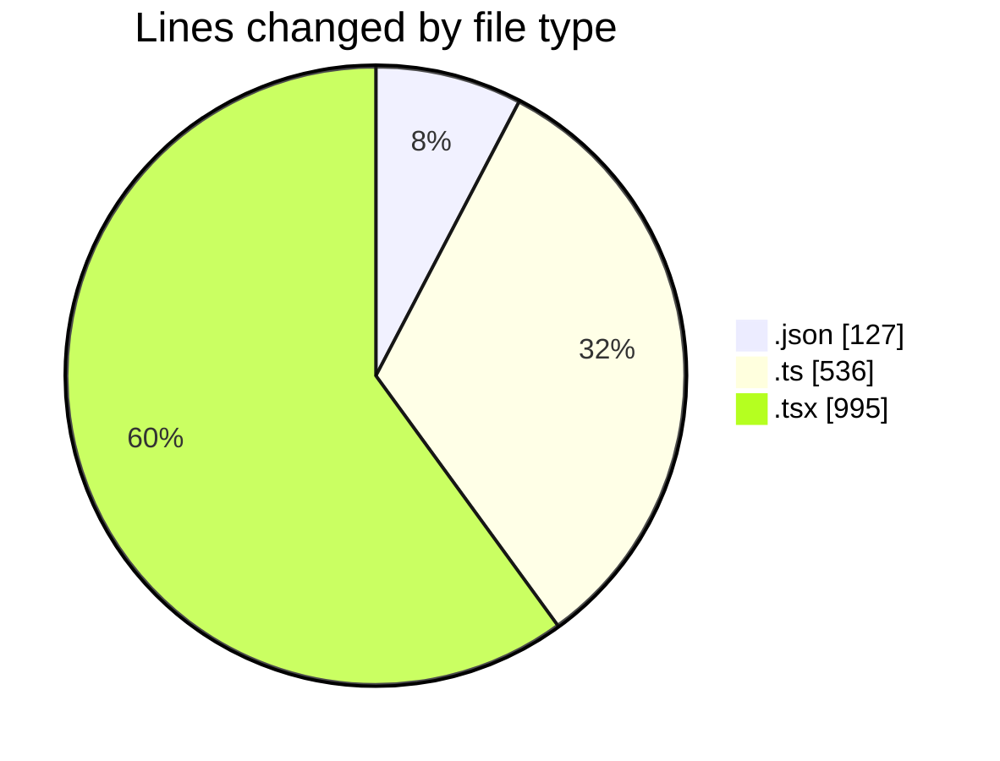
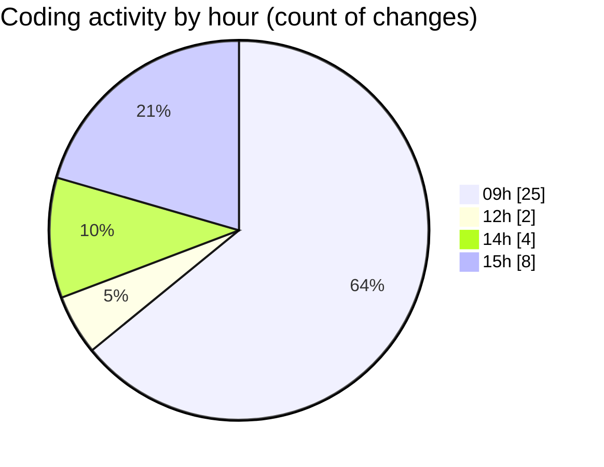

# eventscop-frontend-guide (Workspace) - Activity Summary 

## Overall Statistics

| Stat                   | Value                                                             |
| ---------------------- | ----------------------------------------------------------------- |
| **Lines Added** (➕)   | 1214                                          |
| **Lines Removed** (➖) | 444                                        |
| **Net Change** (↕)    | 770                |
| **Active Time** (⌚)   | 60 minutes |

## Modified Files
- **package.json** (+7, -4)
- **package.json** (+114, -2)
- **referenced-entities.ts** (+115, -0)
- **page.tsx** (+603, -325)
- **searchHelpers.ts** (+322, -99)
- **CompleteYourCartItem.tsx** (+53, -14)

## Visualizations

### By File Type (Lines Changed)

### By Hour (Estimated Activity Count)

> **Last Updated:** 11/12/2025, 3:14:26 PM