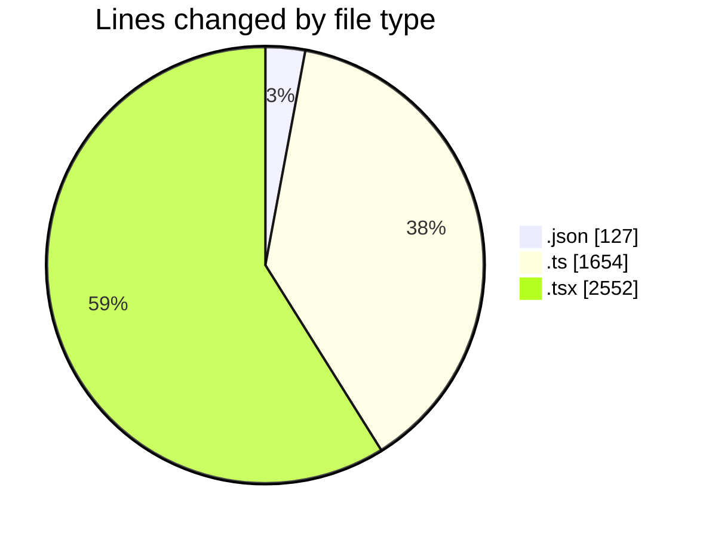
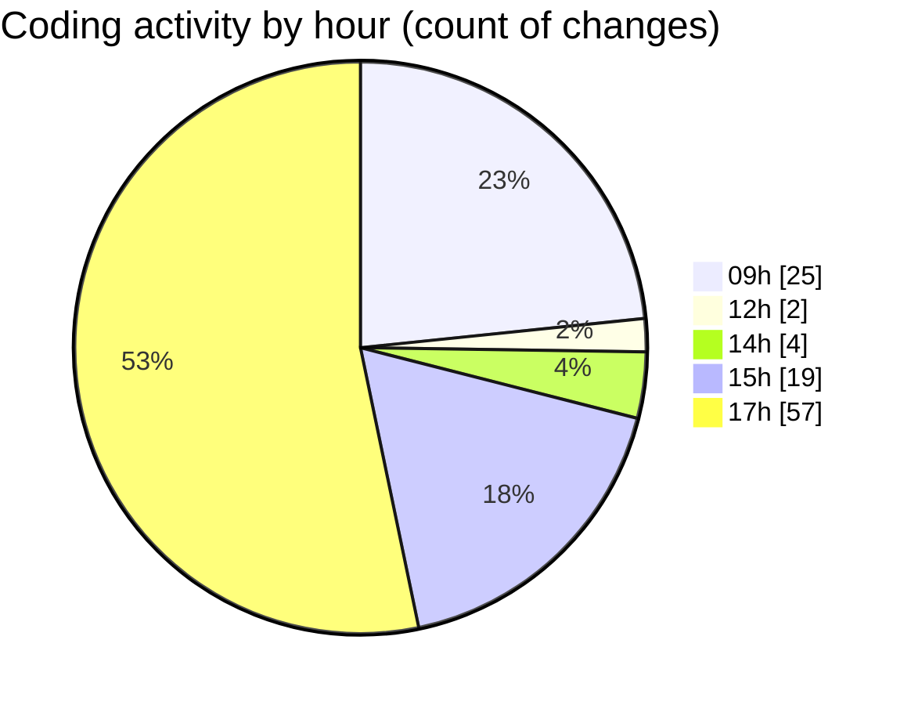

# eventscop-frontend-guide (Workspace) - Activity Summary 

## Overall Statistics

| Stat                   | Value                                                             |
| ---------------------- | ----------------------------------------------------------------- |
| **Lines Added** (➕)   | 3709                                          |
| **Lines Removed** (➖) | 624                                        |
| **Net Change** (↕)    | 3085                |
| **Active Time** (⌚)   | 135 minutes |

## Modified Files
- **package.json** (+7, -4)
- **package.json** (+114, -2)
- **referenced-entities.ts** (+115, -0)
- **page.tsx** (+603, -325)
- **searchHelpers.ts** (+323, -102)
- **CompleteYourCartItem.tsx** (+53, -15)
- **CompleteYourCart.tsx** (+96, -2)
- **criteria-builders.ts** (+92, -3)
- **useBriefReset.ts** (+48, -10)
- **route.ts** (+47, -2)
- **route.ts** (+110, -7)
- **utils-server.ts** (+263, -12)
- **page.tsx** (+117, -10)
- **page.tsx** (+83, -10)
- **page.tsx** (+239, -10)
- **page.tsx** (+94, -9)
- **page.tsx** (+98, -10)
- **page.tsx** (+111, -11)
- **page.tsx** (+125, -10)
- **page.tsx** (+71, -11)
- **page.tsx** (+396, -11)
- **HeaderTopBar.tsx** (+31, -1)
- **useSearch.ts** (+261, -33)
- **location-params.ts** (+11, -0)
- **useFilterContainer.ts** (+80, -14)
- **next.config.ts** (+121, -0)

## Visualizations

### By File Type (Lines Changed)

### By Hour (Estimated Activity Count)

> **Last Updated:** 11/12/2025, 5:44:26 PM