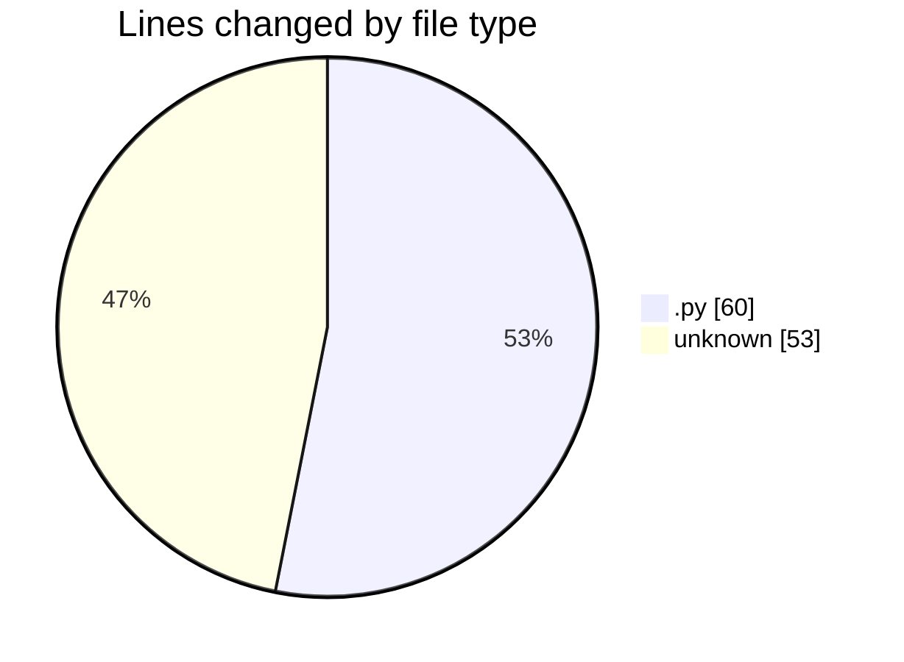
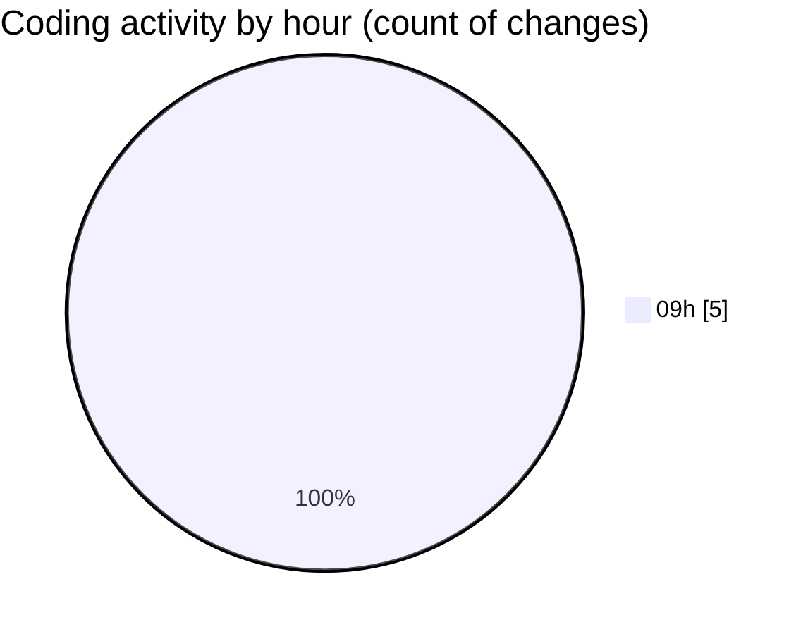

# eventscop-api-guide (Workspace) - Activity Summary 

## Overall Statistics

| Stat                   | Value                                                             |
| ---------------------- | ----------------------------------------------------------------- |
| **Lines Added** (➕)   | 110                                          |
| **Lines Removed** (➖) | 3                                        |
| **Net Change** (↕)    | 107                |
| **Active Time** (⌚)   | 4 minutes |

## Modified Files
- **hybrid_auth.py** (+57, -3)
- **.env** (+53, -0)

## Visualizations

### By File Type (Lines Changed)

### By Hour (Estimated Activity Count)

> **Last Updated:** 11/13/2025, 9:50:18 AM