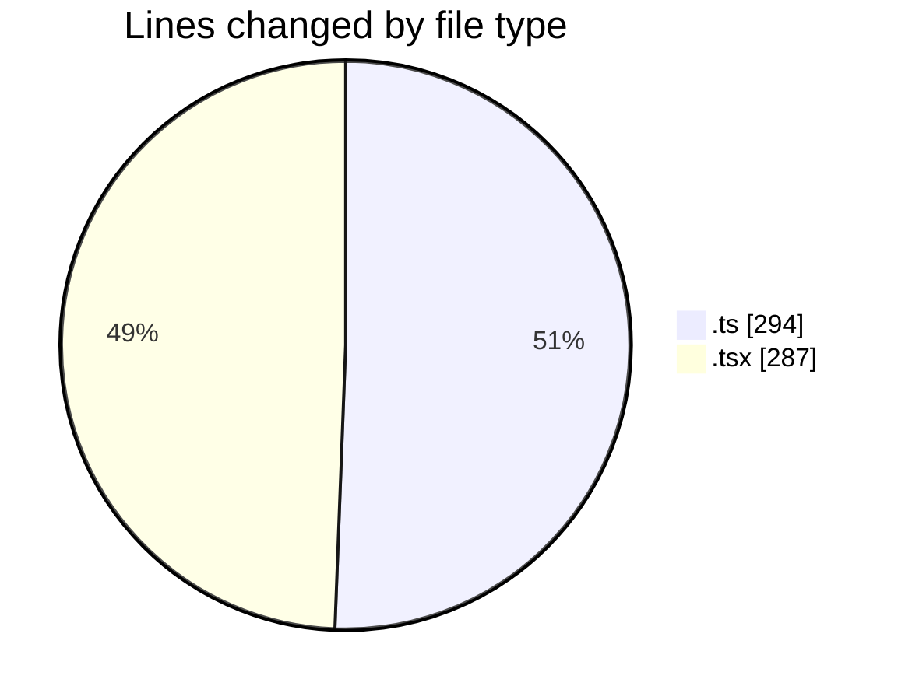
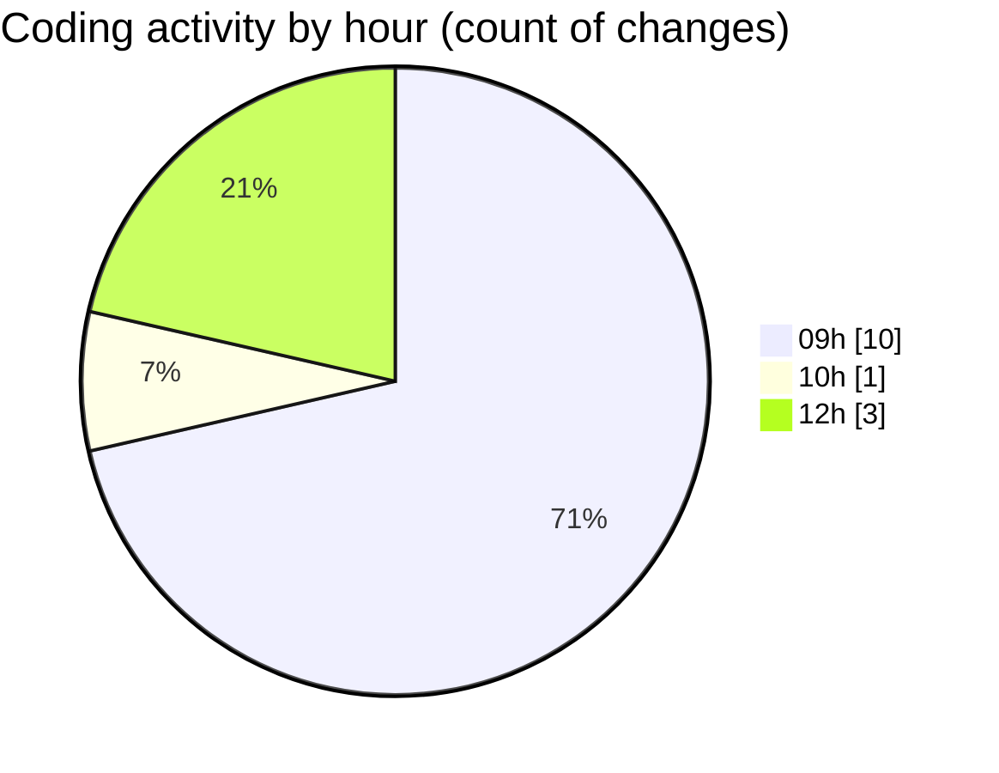

# eventscop-frontend-guide (Workspace) - Activity Summary 

## Overall Statistics

| Stat                   | Value                                                             |
| ---------------------- | ----------------------------------------------------------------- |
| **Lines Added** (➕)   | 521                                          |
| **Lines Removed** (➖) | 60                                        |
| **Net Change** (↕)    | 461                |
| **Active Time** (⌚)   | 20 minutes |

## Modified Files
- **api-auth.ts** (+82, -23)
- **route.ts** (+136, -29)
- **next.config.ts** (+5, -5)
- **robots.ts** (+14, -0)
- **page.tsx** (+284, -3)

## Visualizations

### By File Type (Lines Changed)

### By Hour (Estimated Activity Count)

> **Last Updated:** 11/13/2025, 12:19:30 PM