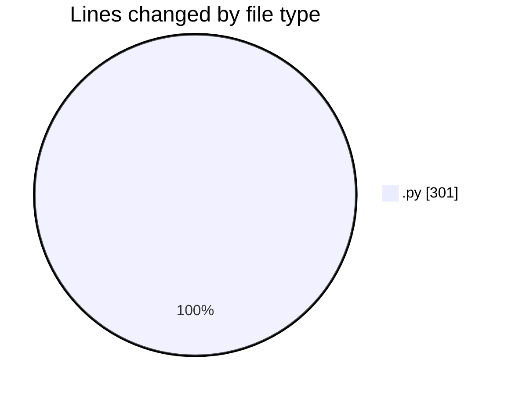

# eventscop-api-guide (Workspace) - Activity Summary 

## Overall Statistics

| Stat                   | Value                                                             |
| ---------------------- | ----------------------------------------------------------------- |
| **Lines Added** (➕)   | 301                                          |
| **Lines Removed** (➖) | 0                                        |
| **Net Change** (↕)    | 301                |
| **Active Time** (⌚)   | 0 minute |

## Modified Files
- **__init__.py** (+152, -0)
- **i18n_utils.py** (+149, -0)

## Visualizations

### By File Type (Lines Changed)

### By Hour (Estimated Activity Count)

> **Last Updated:** 11/14/2025, 12:45:19 AM