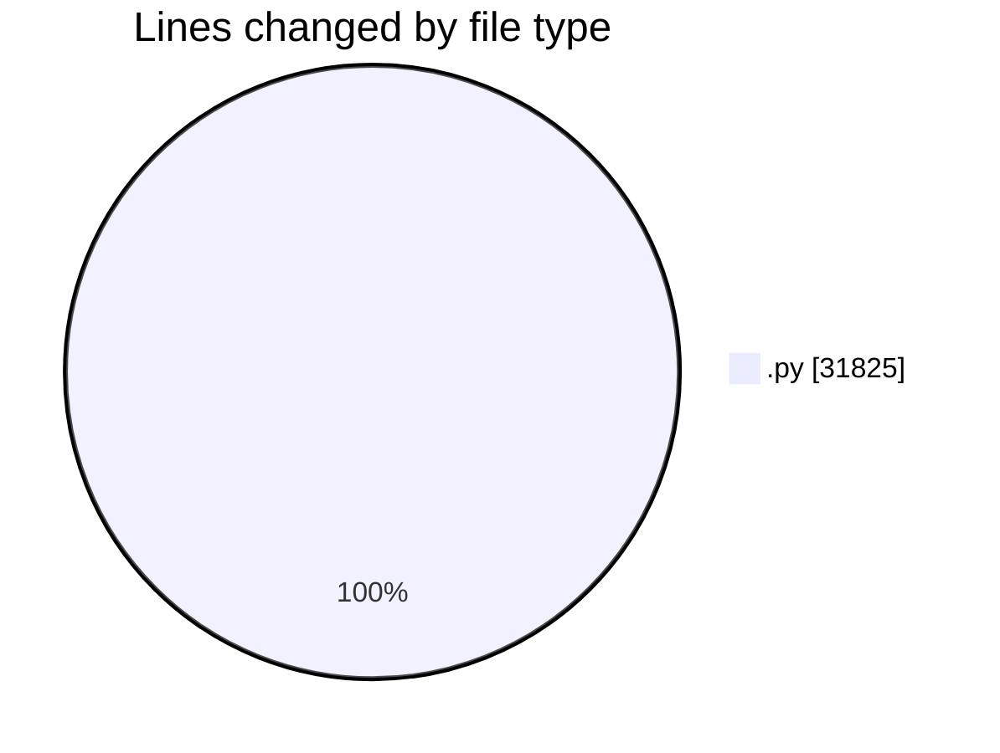
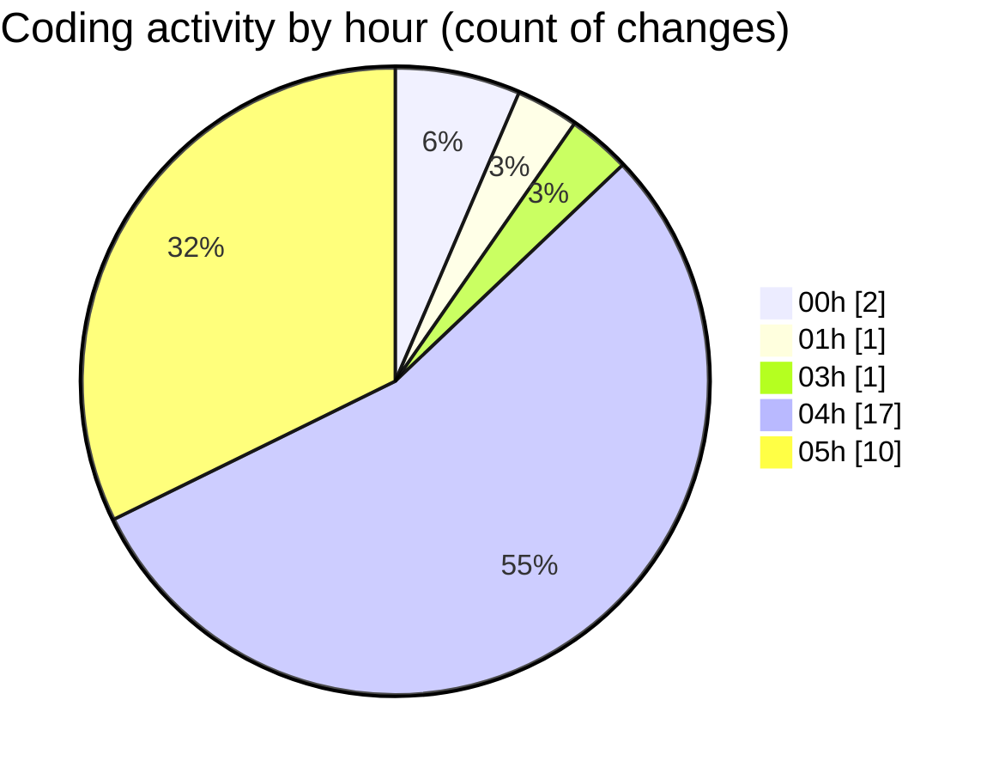

# eventscop-api-guide (Workspace) - Activity Summary 

## Overall Statistics

| Stat                   | Value                                                             |
| ---------------------- | ----------------------------------------------------------------- |
| **Lines Added** (➕)   | 24191                                          |
| **Lines Removed** (➖) | 7634                                        |
| **Net Change** (↕)    | 16557                |
| **Active Time** (⌚)   | 40 minutes |

## Modified Files
- **__init__.py** (+152, -0)
- **i18n_utils.py** (+343, -0)
- **148fac062149_example_i18n_migration.py** (+58, -0)
- **148fac062148_add_i18n_locales_and_i18n_locale_.py** (+22888, -7629)
- **148fac062149_example_i18n_migration.py** (+62, -0)
- **I18nLocaleLanguage.py** (+23, -0)
- **main.py** (+293, -0)
- **routes.py** (+130, -5)
- **service.py** (+183, -0)
- **TEMPLATE_i18n_migration.py** (+59, -0)

## Visualizations

### By File Type (Lines Changed)

### By Hour (Estimated Activity Count)

> **Last Updated:** 11/14/2025, 5:40:22 AM