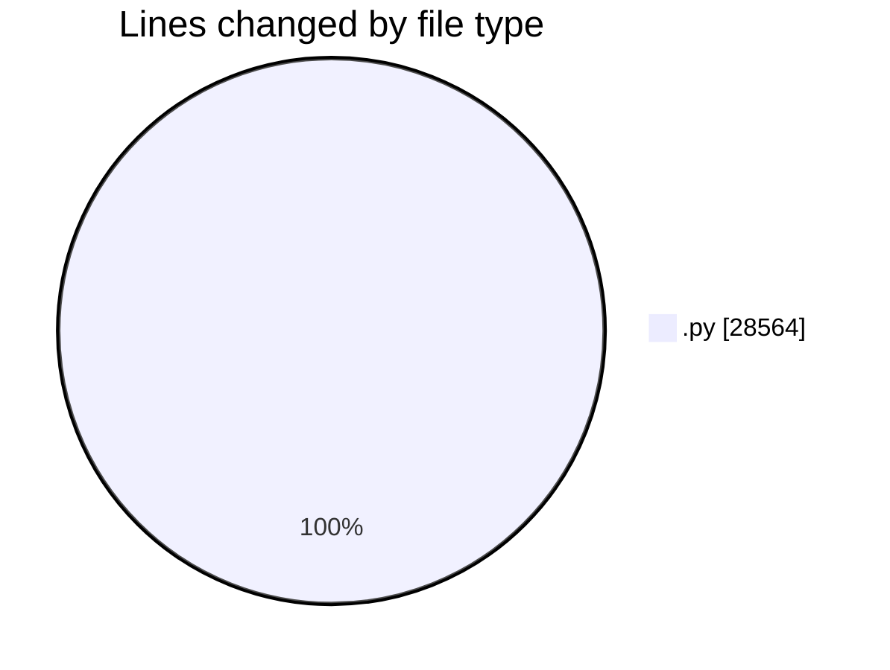
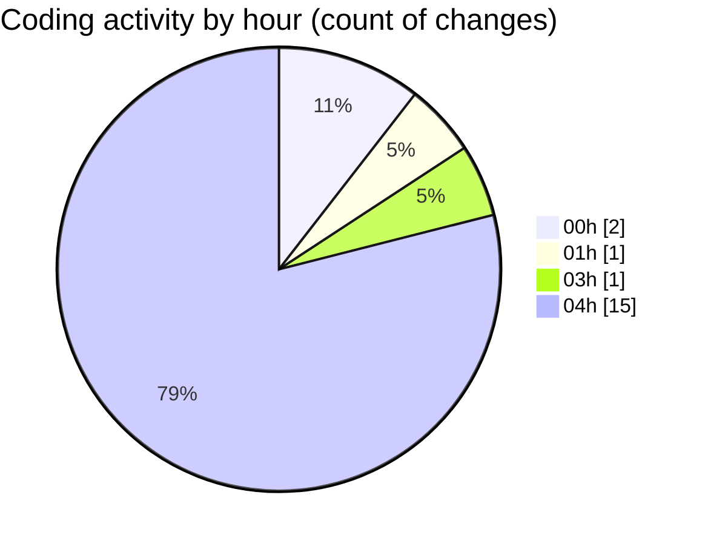

# eventscop-api-guide (Workspace) - Activity Summary 

## Overall Statistics

| Stat                   | Value                                                             |
| ---------------------- | ----------------------------------------------------------------- |
| **Lines Added** (➕)   | 20936                                          |
| **Lines Removed** (➖) | 7628                                        |
| **Net Change** (↕)    | 13308                |
| **Active Time** (⌚)   | 23 minutes |

## Modified Files
- **__init__.py** (+152, -0)
- **i18n_utils.py** (+324, -0)
- **148fac062149_example_i18n_migration.py** (+58, -0)
- **148fac062148_add_i18n_locales_and_i18n_locale_.py** (+20317, -7628)
- **148fac062149_example_i18n_migration.py** (+62, -0)
- **I18nLocaleLanguage.py** (+23, -0)

## Visualizations

### By File Type (Lines Changed)

### By Hour (Estimated Activity Count)

> **Last Updated:** 11/14/2025, 4:40:22 AM