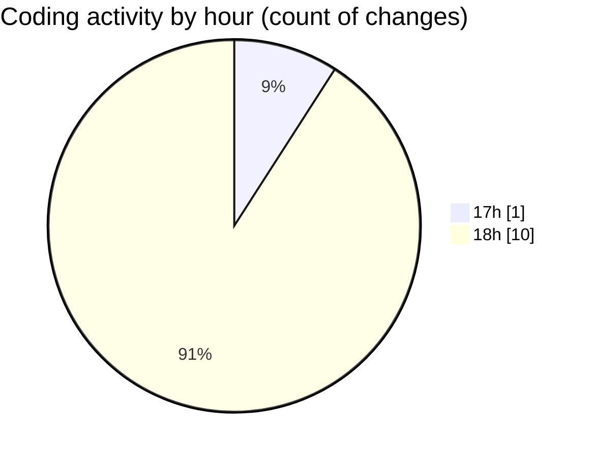

# eventscop-api-guide (Workspace) - Activity Summary 

## Overall Statistics

| Stat                   | Value                                                             |
| ---------------------- | ----------------------------------------------------------------- |
| **Lines Added** (➕)   | 662                                          |
| **Lines Removed** (➖) | 0                                        |
| **Net Change** (↕)    | 662                |
| **Active Time** (⌚)   | 16 minutes |

## Modified Files
- **Supplier.py** (+127, -0)
- **schemas_base.py** (+121, -0)
- **SmartTag.py** (+105, -0)
- **__init__.py** (+153, -0)
- **30617b8823cd_add_smarttags.py** (+156, -0)

## Visualizations

### By File Type (Lines Changed)

### By Hour (Estimated Activity Count)

> **Last Updated:** 11/15/2025, 6:19:02 PM