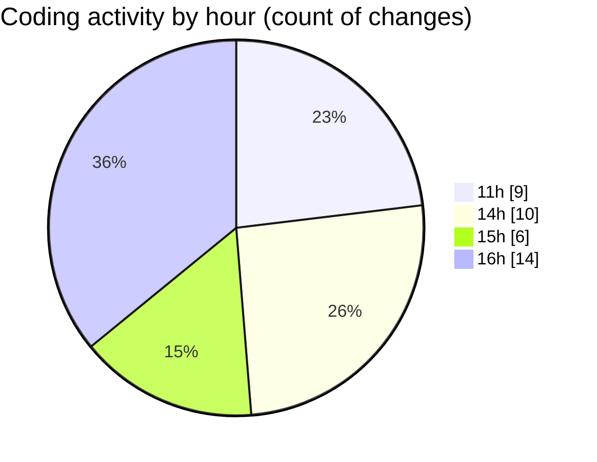

# usr.aleoudev.fr (Workspace) - Activity Summary 

## Overall Statistics

| Stat                   | Value                                                             |
| ---------------------- | ----------------------------------------------------------------- |
| **Lines Added** (➕)   | 10697                                          |
| **Lines Removed** (➖) | 75                                        |
| **Net Change** (↕)    | 10622                |
| **Active Time** (⌚)   | 61 minutes |

## Modified Files
- **data-load.asp** (+3252, -4)
- **facture_presta_pdf.asp** (+1259, -0)
- **amex-cdp.asp** (+622, -0)
- **avis_aleou.asp** (+328, -0)
- **crypto-vigenere.asp** (+275, -0)
- **settings.json** (+299, -0)
- **cli_cdc.asp** (+1303, -40)
- **virtuatab.asp** (+965, -9)
- **frs_demande.asp** (+2394, -22)

## Visualizations

### By File Type (Lines Changed)

### By Hour (Estimated Activity Count)

> **Last Updated:** 11/15/2025, 4:34:04 PM