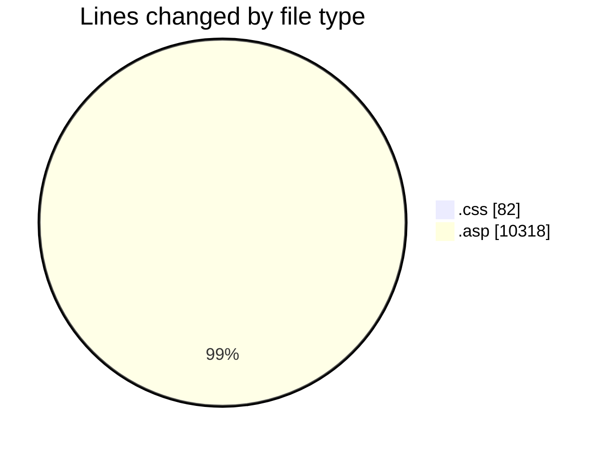
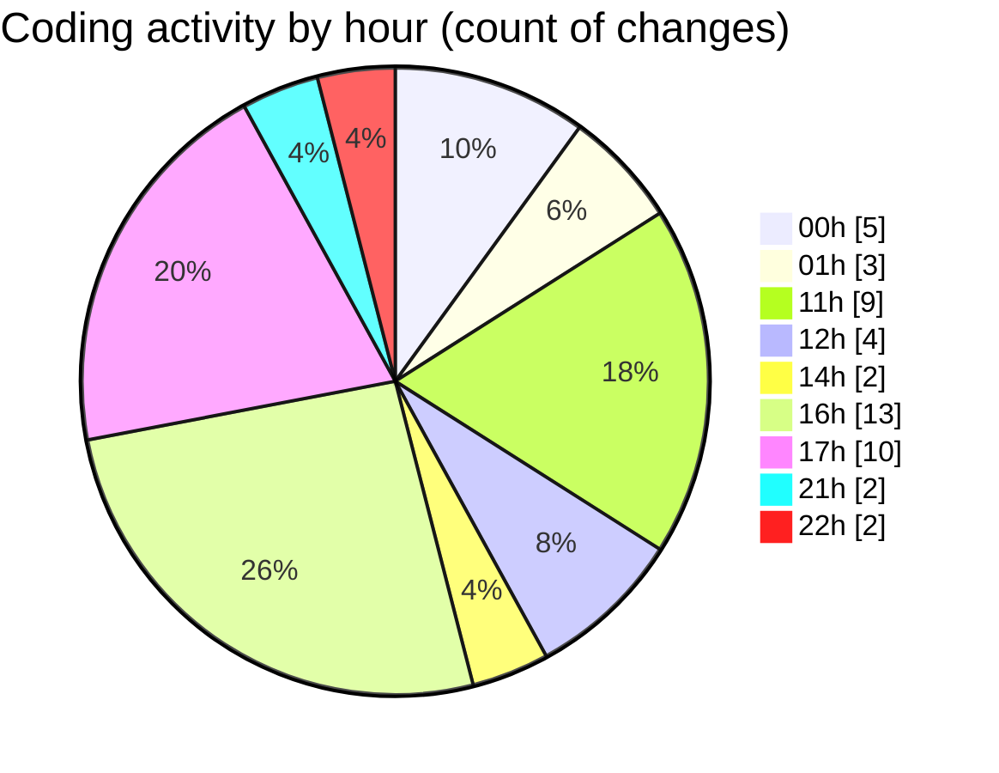

# cdp.aleoudev.fr (Workspace) - Activity Summary 

## Overall Statistics

| Stat                   | Value                                                             |
| ---------------------- | ----------------------------------------------------------------- |
| **Lines Added** (➕)   | 10291                                          |
| **Lines Removed** (➖) | 109                                        |
| **Net Change** (↕)    | 10182                |
| **Active Time** (⌚)   | 80 minutes |

## Modified Files
- **main.css** (+82, -0)
- **ajax_etab_list.asp** (+0, -84)
- **ajax_presta_list.asp** (+329, -3)
- **demande_step_0_view.asp** (+0, -2)
- **home.asp** (+833, -1)
- **societe_form.asp** (+1623, -1)
- **demande_action_db.asp** (+2012, -0)
- **demande_step_0.asp** (+18, -1)
- **ajax_utils.asp** (+513, -0)
- **facture_client_pdf.asp** (+1489, -16)
- **facture_client_brouillon_pdf.asp** (+1469, -0)
- **data-load.asp** (+5, -0)
- **entry.asp** (+446, -1)
- **seminar_service.asp** (+724, -0)
- **accurate_relation_service.asp** (+748, -0)

## Visualizations

### By File Type (Lines Changed)

### By Hour (Estimated Activity Count)

> **Last Updated:** 11/16/2025, 10:45:11 PM