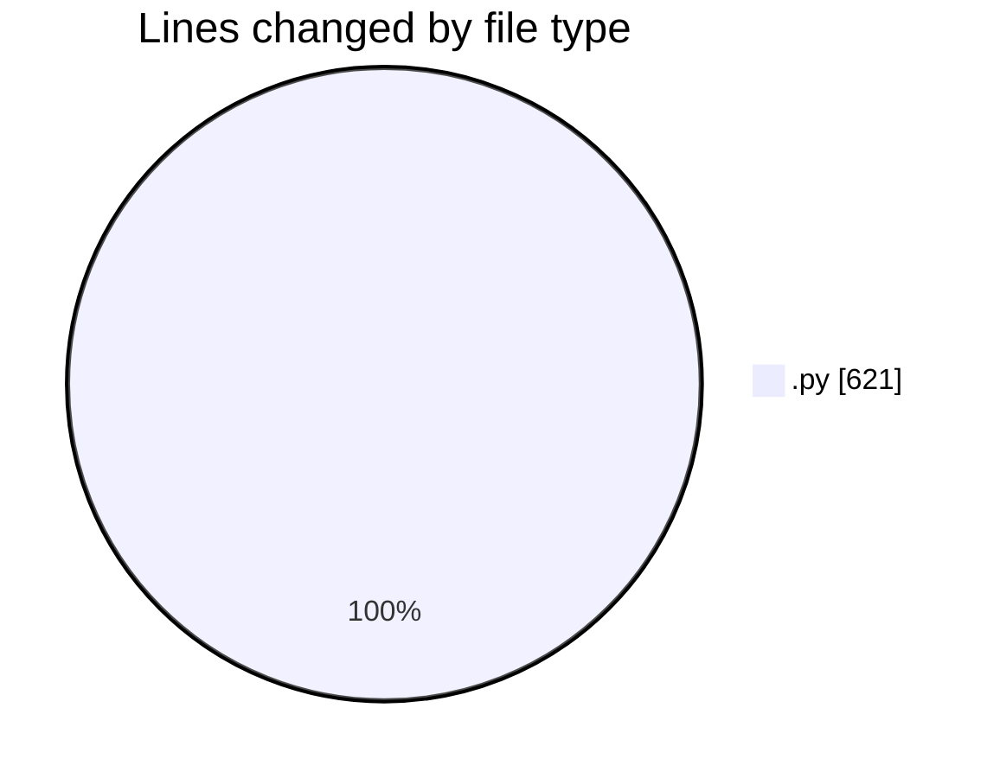
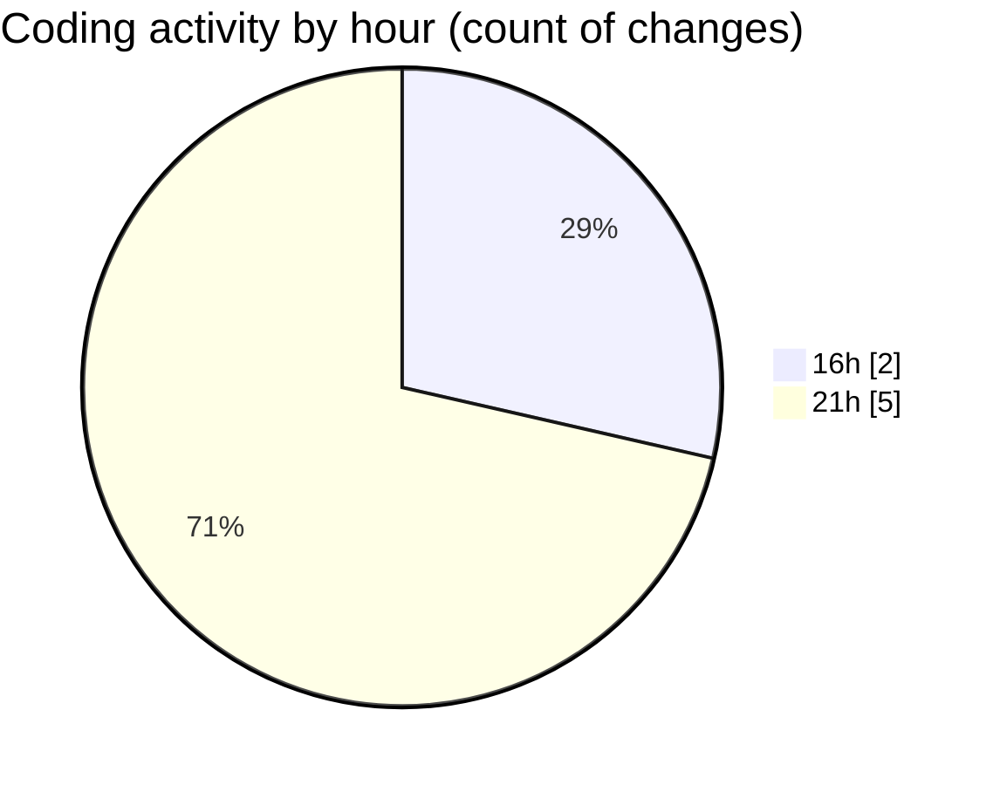

# eventscop-api-guide (Workspace) - Activity Summary 

## Overall Statistics

| Stat                   | Value                                                             |
| ---------------------- | ----------------------------------------------------------------- |
| **Lines Added** (➕)   | 614                                          |
| **Lines Removed** (➖) | 7                                        |
| **Net Change** (↕)    | 607                |
| **Active Time** (⌚)   | 9 minutes |

## Modified Files
- **routes.py** (+614, -1)
- **Supplier.py** (+0, -2)
- **schemas_base.py** (+0, -1)
- **__init__.py** (+0, -3)

## Visualizations

### By File Type (Lines Changed)

### By Hour (Estimated Activity Count)

> **Last Updated:** 11/16/2025, 9:24:06 PM