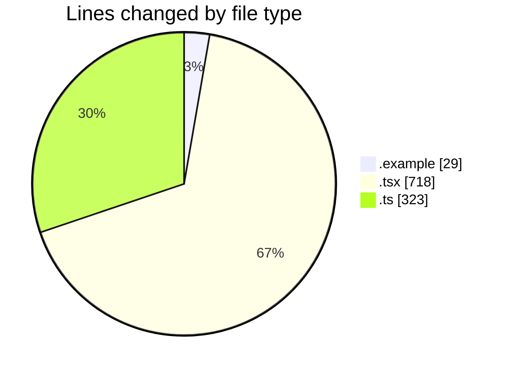
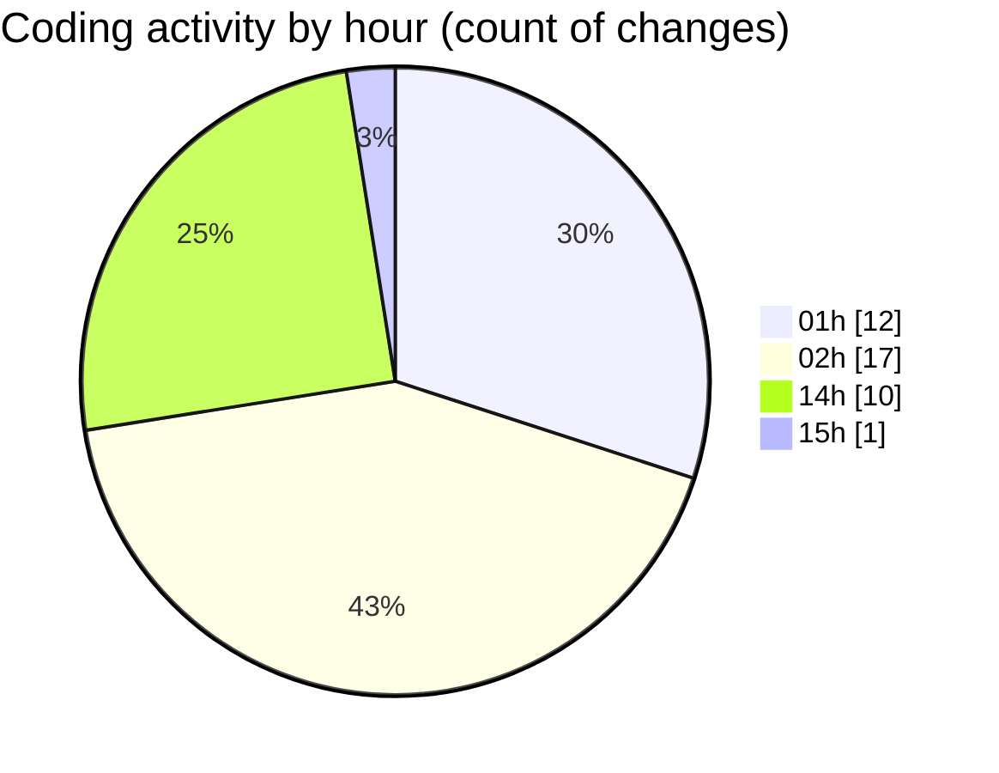

# eventscop-frontend-guide (Workspace) - Activity Summary 

## Overall Statistics

| Stat                   | Value                                                             |
| ---------------------- | ----------------------------------------------------------------- |
| **Lines Added** (➕)   | 1025                                          |
| **Lines Removed** (➖) | 45                                        |
| **Net Change** (↕)    | 980                |
| **Active Time** (⌚)   | 66 minutes |

## Modified Files
- **.env.example** (+28, -1)
- **SearchPageForm.tsx** (+306, -3)
- **ProviderFiltersContainer.tsx** (+101, -4)
- **search-filters.ts** (+87, -2)
- **ProviderFilterContent.tsx** (+75, -27)
- **SupplierSearchContainer.tsx** (+120, -7)
- **search-state.ts** (+119, -1)
- **FiltersModal.tsx** (+75, -0)
- **stats.ts** (+55, -0)
- **search-cache.ts** (+59, -0)

## Visualizations

### By File Type (Lines Changed)

### By Hour (Estimated Activity Count)

> **Last Updated:** 11/16/2025, 3:04:33 PM