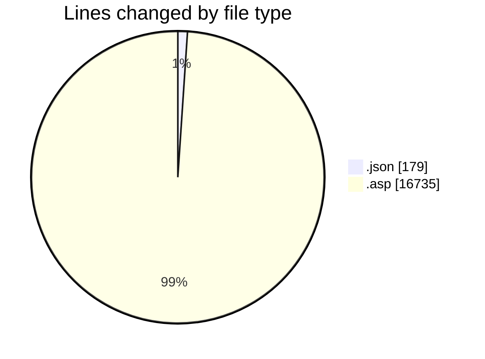
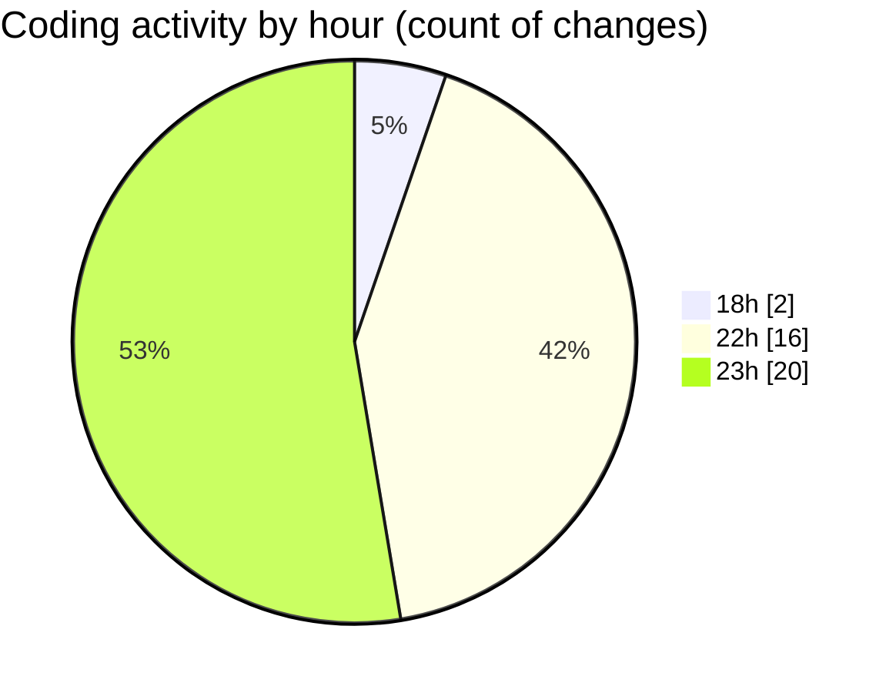

# cdp.aleoudev.fr (Workspace) - Activity Summary 

## Overall Statistics

| Stat                   | Value                                                             |
| ---------------------- | ----------------------------------------------------------------- |
| **Lines Added** (➕)   | 16894                                          |
| **Lines Removed** (➖) | 20                                        |
| **Net Change** (↕)    | 16874                |
| **Active Time** (⌚)   | 52 minutes |

## Modified Files
- **tags.json** (+178, -1)
- **EmpreinteCoo.class.asp** (+2129, -10)
- **ajax_utils.asp** (+520, -7)
- **demande_action_db.asp** (+2013, -0)
- **group_search.asp** (+110, -1)
- **group_form.asp** (+76, -1)
- **sbar.asp** (+526, -0)
- **SmartTag.asp** (+67, -0)
- **demande_step_1.asp** (+2929, -0)
- **supplier_search.asp** (+1081, -0)
- **ajax_etab_list.asp** (+322, -0)
- **ajax_presta_list.asp** (+326, -0)
- **call_suppliers.asp** (+580, -0)
- **client_search.asp** (+384, -0)
- **supplier_form.asp** (+3942, -0)
- **client_form.asp** (+1711, -0)

## Visualizations

### By File Type (Lines Changed)

### By Hour (Estimated Activity Count)

> **Last Updated:** 11/17/2025, 11:55:13 PM